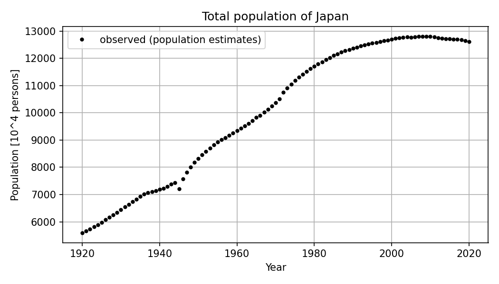

# 第1回　数理モデルの考え方

## 講義全体のワークフローと今回の位置付け

この講義では，オープンデータで観測された現象を，時間とともに変化する量の関係式，すなわち微分方程式モデルとして表し，そのモデルをデータによって評価し，改善するまでの一連の流れを経験する．

1. 現象の理解
2. 仮定の設定
3. 数理モデルの構築
4. 数値シミュレーション
5. データとの比較
6. パラメタ推定
7. モデルの検証と改善

今回はこの流れの最初の2段階，1.現象の理解と2.仮定の設定を扱う．
数式を解くことよりも，現象のどの部分を式のどの項で表すのかを考えることに時間を使う．

| 講義の段階 | 主な題材 | 学ぶこと |
| --- | --- | --- |
| 第1〜2回 | 考え方と計算の道具 | モデルの要素，変化率，初期値問題，Euler法，`solve_ivp` |
| 第3〜5回 | 人口統計 | 指数成長，Logisticモデル，モデルの比較，パラメタサーチ |
| 第6〜8回 | 河川流量・ダム貯水量 | 保存則，観測データを入力とするモデル，パラメタ推定，タンクモデル |
| 第9回 | 観光・電力需要 | 周期的な外力，季節性 |
| 第10〜11回 | 生態系・感染症 | 連立微分方程式，相互作用，コンパートメントモデル |
| 第12回 | モデルの検証と発展 | 残差，検証用データ，誤差の種類，モデルの拡張 |
| 第13回 | 最終レポートの準備 | 題材選び，計画書，レポートの構成 |

### 応用プログラミングIとのつながり

応用プログラミングIでは，オープンデータを取得し，整形し，可視化して，対象の特徴や関係を調べた．
そこで作った図は「いつ，何が，どれだけ変わったか」を示す．
しかし，図を眺めるだけでは「なぜそのように変わったのか」「これから先はどうなるのか」には答えられない．

応用プログラミングIIでは，変化の仕組みについて仮定を置き，その仮定を式で表し，式から計算した結果をデータと比べる．
式とデータが合わなければ仮定を見直す．
この往復を通じて，データの背後にある仕組みを説明できるようになることが目標である．

## 今回の到達目標

- 数理モデルが「現実をそのまま再現するもの」ではなく「目的に応じて必要な要素を取り出した表現」であることを説明できる
- 現象から，状態変数，観測量，パラメタ，初期条件，外部入力，仮定を区別して取り出せる
- 「一定量ずつ増える」と「現在量に比例して増える」という2つの仮定を，差分の式と変化率の式で書き分けられる
- Pythonで漸化式を計算し，パラメタと初期値を変えた結果を図と文章で説明できる
- 同じ人口データに2つのモデルを重ね，どちらの仮定がどの期間で合うかを述べられる

**今回の流れ**（105分の目安）

| 段階 | 内容 | 時間 |
| --- | --- | --- |
| 1 | 講義の位置付け，作業環境の確認（演習0） | 10分 |
| 2 | 数理モデルの要素，2つの成長の仮定と式（演習1） | 25分 |
| 3 | Pythonによる漸化式の計算と可視化 | 20分 |
| 4 | パラメタと初期値の比較，人口データとの重ね合わせ（演習2〜4） | 35分 |
| 5 | モデルの限界の共有，まとめ，課題の説明 | 15分 |

## 準備

各回の作業は，応用プログラミングIと同じく，ホームフォルダの中の作業フォルダにまとめる．
データは共通の`data`フォルダに置き，各回のノートブックから読み込む．

````{note} 演習0：作業フォルダとNotebookを作成する

1. ターミナルで次のコマンドを実行し，第1回の作業フォルダと共通のデータフォルダを作成する．

```bash
mkdir -p ~/applied_programming_ii/01
mkdir -p ~/applied_programming_ii/data
cd ~/applied_programming_ii/01
mkdir -p notebooks reports/figures
```

2. 講義サイトの[授業用データ一覧](../data/README.md)から`population_japan.csv`をダウンロードし，`~/applied_programming_ii/data/`に置く．

3. JupyterLabまたはVS Codeで，`notebooks/modeling.ipynb`を新規作成する．

4. `01`フォルダに`README.md`を作り，次の内容を記入する．演習で条件を変えたときは，その条件と結果を追記する．

```markdown
# 応用プログラミングII 第1回

- 氏名：
- 学籍番号：

## 今日の目標

現象を数理モデルの要素に分け，2つの成長の仮定を式で表して比べる．

## 演習1：現象の分解

（表をここに書く）

## 演習2〜4の記録

- 変更した条件：
- 実行前の予想：
- 実行後に分かったこと：

## 課題1

## 課題2の考察
```

5. Notebookの最初のコードセルに以下を入力し，実行できることを確認する．今回使うライブラリはここでまとめて読み込む．

```python
from pathlib import Path

import numpy as np
import pandas as pd
import matplotlib.pyplot as plt

print("NumPy:", np.__version__)
print("pandas:", pd.__version__)

# Notebookをどこから開いても，同じ作業フォルダとデータフォルダを参照する．
PROJECT_DIR = Path.home() / "applied_programming_ii" / "01"
DATA_DIR = Path.home() / "applied_programming_ii" / "data"
FIGURE_DIR = PROJECT_DIR / "reports" / "figures"
FIGURE_DIR.mkdir(parents=True, exist_ok=True)

print("作業フォルダ:", PROJECT_DIR)
print("データフォルダ:", DATA_DIR)
print("人口データの有無:", (DATA_DIR / "population_japan.csv").exists())
```

最後の行が`True`になっていれば準備完了である．
````

````{dropdown} 補足：Python環境が未準備の場合

応用プログラミングIで使った環境があればそのまま使える．
新しく用意する場合は，ターミナルで次を実行する．

```bash
cd ~/applied_programming_ii
python3 -m venv .venv
source .venv/bin/activate
pip install numpy pandas matplotlib scipy jupyterlab
```

`scipy`は第2回から使う．
````

## 導入：データは何を教えてくれるか

まず，この講義で繰り返し使う人口データを見ておく．
下の図は，総務省統計局「人口推計」の長期時系列データから作った，日本の総人口の推移である．



```python
population = pd.read_csv(DATA_DIR / "population_japan.csv")

# 単位を千人から万人に直した列を追加する．
population["population_10k"] = population["total_population_thousand"] / 10

print(population.head())
print(population.tail())
print("期間:", population["year"].min(), "〜", population["year"].max(), " 行数:", len(population))
```

```python
fig, ax = plt.subplots(figsize=(7, 4))
ax.plot(population["year"], population["population_10k"], color="black", marker="o", markersize=3, linestyle="none", label="observed (population estimates)")
ax.set_title("Total population of Japan")
ax.set_xlabel("Year")
ax.set_ylabel("Population [10^4 persons]")
ax.grid(True)
ax.legend()
fig.tight_layout()
fig.savefig(FIGURE_DIR / "population_observed.png", dpi=150)
plt.show()
```

この図から「1920年に約5600万人だった人口が，2008年ごろに約1億2800万人で頭打ちになり，その後減り始めた」ことは読み取れる．
しかし，次の問いには図だけでは答えられない．

- なぜ最初は加速するように増え，途中から増え方が鈍ったのか
- 増え方を決めているのは何か
- もし出生率や寿命が違っていたら，どのような曲線になっていたか

これらに答えるには，「人口はどのような仕組みで変化するのか」についての考え，つまり**仮定**が必要になる．
仮定を式にしたものが数理モデルである．

```{tip} 観測量と状態変数は同じものではない
この表の人口は，各年10月1日時点の値である．
国勢調査の年はその調査結果，それ以外の年は出生・死亡・出入国の届出から推計した値が入っている．
一方，モデルで扱う「人口」は，時刻とともに連続的に変わる量として考える．
観測データはその量を特定の時刻に測った標本にすぎず，測り方による誤差も含む．
この区別は，講義を通じて何度も現れる．
```

## 数理モデルとは何か

### 目的に応じて要素を選ぶ

数理モデルとは，現実の現象から，目的に応じて必要な要素だけを取り出し，数と式で表したものである．
現実をそのまま再現することは目的ではないし，そもそも不可能である．

例えば，「日本の総人口が今後どのように変わるか」を考えるとき，一人一人の氏名や住所は不要である．
しかし「各都道府県の人口がどう変わるか」を考えるなら，地域間の移動を入れなければならない．
目的が変われば，取り出す要素も，式の形も変わる．

### モデルを構成する要素

現象をモデルにするとき，次の要素を区別して書き出す．

| 要素 | 意味 | 人口の例 |
| --- | --- | --- |
| 現象 | 説明したい対象 | 日本の総人口の変化 |
| 目的 | モデルで答えたい問い | 増え方の仕組みを説明する，将来を見積もる |
| 状態変数 | 時間とともに変わり，現象の状態を表す量 | ある時刻の人口 $N(t)$ |
| 観測量 | 実際に測られ，データとして手に入る量 | 各年10月1日の人口推計値 |
| パラメタ | モデルの中で一定とみなす数 | 1年あたりの増加率 $r$ |
| 初期条件 | 計算を始める時刻の状態変数の値 | 1920年の人口 |
| 外部入力 | モデルの外から与えられ，状態に影響する量 | 出入国者数，政策 |
| 仮定 | 現象の仕組みについて置く前提 | 増加量は現在の人口に比例する |

状態変数と観測量の違い，パラメタと外部入力の違いには注意が必要である．

- パラメタは，モデルの中では時間によらず一定とみなす数である．値は分からないことが多く，データから推定する対象になる（第5回，第7回）．
- 外部入力は，時間とともに変わるが，モデルの中では決まらない量である．ダムへの流入量のように，観測データをそのまま入力として与えることもある（第6回）．

````{note} 演習1：身近な現象をモデルの要素に分解する

次のうち1つを選び，上の表の8つの要素を`README.md`の「演習1」に書く．
分からない要素は「不明」と書き，どうすれば分かるかを1行添える．

- スマートフォンのバッテリー残量
- 教室の気温
- SNSアカウントのフォロワー数
- 部屋の中の二酸化炭素濃度
- ダムの貯水量

書き終えたら，隣の人と表を交換し，「状態変数」と「観測量」が同じものになっていないか，「パラメタ」と「外部入力」が入れ替わっていないかを互いに確認する．
````

```{dropdown} 演習1の確認：バッテリー残量の例
- 現象：スマートフォンのバッテリー残量の変化
- 目的：あと何時間使えるかを見積もる
- 状態変数：残量（電荷量）$Q(t)$，単位は mAh
- 観測量：画面に表示される残量の割合（%）．電荷量そのものではなく，推定値である
- パラメタ：待機時の消費電流，満充電容量
- 初期条件：計算を始める時刻の残量
- 外部入力：画面を使っている時間，充電器の接続
- 仮定：消費電流は使い方ごとに一定とみなす，容量の劣化は無視する

残量の表示は「%」であり，電荷量を容量で割って丸めた値である．
観測量と状態変数が一致しない典型的な例になっている．
```

## 変化を式で表す

### 2つの仮定：一定量ずつ増える，現在量に比例して増える

状態変数を $x$ とし，1年ごとの値を $x_0, x_1, x_2, \ldots$ と書く．
$x_k$ は $k$ 年後の値である．
「増える」という現象について，最も単純な仮定は次の2つである．

**仮定A：毎年一定量 $a$ だけ増える．**

$$
x_{k+1} = x_k + a
$$

**仮定B：毎年，現在量の一定割合 $r$ だけ増える．**

$$
x_{k+1} = x_k + r\,x_k = (1 + r)\,x_k
$$

$a$ の単位は「状態変数の単位／年」，$r$ の単位は「1／年」である．
人口なら $a$ は「万人／年」，$r$ は「1／年」となり，$r = 0.02$ は「1年で2%増える」を意味する．

$x_0 = 100$，$a = 10$，$r = 0.1$ として最初の数年を手で計算すると次のようになる．

| $k$ | 仮定A：$x_k$ | 仮定B：$x_k$ |
| ---: | ---: | ---: |
| 0 | 100 | 100 |
| 1 | 110 | 110 |
| 2 | 120 | 121 |
| 3 | 130 | 133.1 |
| 4 | 140 | 146.41 |
| 5 | 150 | 161.05 |

最初の1年はどちらも10増えるが，仮定Bでは増える量そのものが年々大きくなる．
どちらが「正しい」かは式からは決まらない．
人口，貯金，細菌のどれを考えているかによって，もっともらしい仮定が変わる．

### 差分から変化率へ

上の2つの式を，「1年あたりの変化量」の形に書き直す．

$$
\frac{x_{k+1} - x_k}{\Delta t} = a,
\qquad
\frac{x_{k+1} - x_k}{\Delta t} = r\,x_k
\qquad (\Delta t = 1\ \text{年})
$$

左辺は，時間 $\Delta t$ の間の変化量を $\Delta t$ で割ったもので，**変化率**と呼ぶ．
ここで $\Delta t$ を1年ではなく半年，1か月，1日と細かくしていくと，左辺は微分 $\dfrac{dx}{dt}$ に近づく．
すると2つの仮定は，次の微分方程式として書ける．

$$
\frac{dx}{dt} = a,
\qquad
\frac{dx}{dt} = r\,x
$$

以後，$\dfrac{dx}{dt}$ を $x'$ と略記することもある．

左の式は「変化率が一定」，右の式は「変化率が現在量に比例する」と読む．
微分方程式は，状態変数そのものではなく，状態変数の**変化の仕方**を指定する式である．
どちらの式も，ある時刻の $x$ の値が分かれば，その瞬間の変化率が決まる．
そこから少し先の値が決まり，さらにその先が決まる，という繰り返しで $x(t)$ 全体が決まる．
この繰り返しを計算機で実行する方法が，第2回で学ぶ数値シミュレーションである．

```{tip} 差分の式と微分の式は少し違う
仮定Bを差分で書いた $x_{k+1} = (1+r)x_k$ の解は $x_k = x_0 (1+r)^k$ である．
一方，微分方程式 $x' = rx$ の解は $x(t) = x_0 e^{rt}$ である（第2回で確認する）．
$r = 0.02$ のとき，50年後の倍率は $(1.02)^{50} = 2.69$ と $e^{1.0} = 2.72$ で，わずかに異なる．
「1年ごとに2%」と「連続的に年率2%」は同じではない．
今回は差分の式を計算し，第2回で微分の式との関係を調べる．
```

### 式の各項が表すもの

微分方程式を書いたら，各項が現象の何を表すかを必ず言葉で説明する．
$x' = rx$ の場合は次のようになる．

| 項 | 意味 | 単位 |
| --- | --- | --- |
| $x'$ | 人口の変化率 | 万人／年 |
| $r$ | 一人あたり，1年あたりの純増加率（出生率から死亡率を引いたもの） | 1／年 |
| $x$ | その時刻の人口 | 万人 |
| $rx$ | 1年あたりに増える人数 | 万人／年 |

両辺の単位が「万人／年」で一致していることを確認する習慣をつける．
単位が合わない式は，どこかで仮定を誤っている．

## Pythonによる最小構成の実装

2つの仮定の差分の式を，そのまま`for`文で計算する．
状態変数の初期値，パラメタ，計算する期間をコードの中で分けて書く．

```python
# 初期条件
x0 = 100.0        # 初期値 [万人]

# 計算する期間
n_years = 50                          # 計算する年数
years = np.arange(0, n_years + 1)     # 0, 1, ..., 50 [年]

# パラメタ
a = 2.0      # 仮定A：1年あたりの増加量 [万人/年]
r = 0.02     # 仮定B：1年あたりの増加率 [1/年]


def constant_growth(x0, a, n_steps):
    """仮定A x_{k+1} = x_k + a を n_steps 回繰り返し，各年の値を配列で返す．"""
    x = np.zeros(n_steps + 1)
    x[0] = x0
    for k in range(n_steps):
        x[k + 1] = x[k] + a
    return x


def proportional_growth(x0, r, n_steps):
    """仮定B x_{k+1} = x_k + r * x_k を n_steps 回繰り返し，各年の値を配列で返す．"""
    x = np.zeros(n_steps + 1)
    x[0] = x0
    for k in range(n_steps):
        x[k + 1] = x[k] + r * x[k]
    return x


x_const = constant_growth(x0, a, n_years)
x_prop = proportional_growth(x0, r, n_years)

for k in [0, 10, 20, 30, 40, 50]:
    print(f"{k:3d}年後  仮定A: {x_const[k]:8.2f} 万人   仮定B: {x_prop[k]:8.2f} 万人")
```

2つの結果を同じ図に描く．
線種とマーカーを変えて，どちらの仮定かが一目で分かるようにする．

```python
fig, ax = plt.subplots(figsize=(7, 4))
ax.plot(years, x_const, marker="o", markersize=3, linestyle="--", label=f"A: constant increase (a = {a} /year)")
ax.plot(years, x_prop, marker="s", markersize=3, linestyle="-", label=f"B: proportional increase (r = {r} /year)")
ax.set_title("Two assumptions about growth")
ax.set_xlabel("Time [year]")
ax.set_ylabel("State variable x [10^4 persons]")
ax.grid(True)
ax.legend()
fig.tight_layout()
fig.savefig(FIGURE_DIR / "two_growth_models.png", dpi=150)
plt.show()
```

$a = 2$，$r = 0.02$ と選んだので，最初の1年の増加量はどちらも2万人で同じである．
しかし50年後には，仮定Aは200万人，仮定Bは約269万人になる．
同じ出発点から始めても，仮定が違えば結果は離れていく．

## パラメタや初期条件を変える演習

````{note} 演習2：パラメタを変える

1. `a`を`1.0`，`3.0`に変えて実行し，50年後の値がどう変わるかを記録する．
2. `r`を`0.01`，`0.03`に変えて実行し，50年後の値がどう変わるかを記録する．
3. `a`を2倍にしたときと，`r`を2倍にしたときで，50年後の値の変わり方がどう違うかを`README.md`に1〜2行で書く．

実行する前に，結果がどうなるかを予想して`README.md`に書いておく．
````

````{note} 演習3：複数のパラメタを1つの図で比べる

次のコードを実行し，$r$ の値によって曲線の形がどう変わるかを観察する．

```python
r_values = [0.01, 0.02, 0.03]

fig, ax = plt.subplots(figsize=(7, 4))
for r_trial in r_values:
    x_trial = proportional_growth(x0, r_trial, n_years)
    ax.plot(years, x_trial, label=f"r = {r_trial} /year")
    print(f"r = {r_trial}: 50年後 = {x_trial[-1]:7.1f} 万人，初期値に対する倍率 = {x_trial[-1] / x0:.2f}")

ax.set_title("Proportional growth with different r (x0 = 100)")
ax.set_xlabel("Time [year]")
ax.set_ylabel("State variable x [10^4 persons]")
ax.grid(True)
ax.legend()
fig.tight_layout()
fig.savefig(FIGURE_DIR / "proportional_growth_r.png", dpi=150)
plt.show()
```

1. $r$ を2倍にすると，50年後の値は2倍になるか．なぜそうなるか，またはならないかを説明する．
2. `r_values`を`[-0.02, 0.0, 0.02]`に変えて実行し，$r$ が負またはゼロのときの曲線の形を説明する．$r < 0$ は現象として何を表すか．
3. 初期値`x0`を`50.0`に変えて実行する．初期値を変えると曲線の形は変わるか，値だけが変わるか．
````

```{dropdown} 演習3の確認
- $r$ を2倍にしても50年後の値は2倍にならない．倍率は $(1+r)^{50}$ であり，$r$ に対して線形ではないためである．$r = 0.01$ で約1.64倍，$r = 0.02$ で約2.69倍，$r = 0.03$ で約4.38倍になる．
- $r < 0$ では毎年一定割合で減る．人口なら死亡が出生を上回る状態，物質なら崩壊や分解を表す．$r = 0$ では変化しない．
- 初期値を変えると，仮定Bの曲線は全体が定数倍されるだけで，形（増え方の割合）は変わらない．$x_k = x_0(1+r)^k$ だからである．
```

## オープンデータとの比較

2つの仮定を，冒頭で見た日本の総人口と重ねてみる．
ここでは，1920年から1970年までの2つの値だけを使ってパラメタを決め，その後の期間にどこまで合うかを見る．
パラメタを丁寧に決める方法は第3回以降で学ぶ．

### データからパラメタを決める

仮定Aの $a$ は，50年間の増加量を50で割れば求まる．
仮定Bの $r$ は，50年で $x_{1970}/x_{1920}$ 倍になったことから，$(1+r)^{50} = x_{1970}/x_{1920}$ を解いて求める．

```python
year_start, year_end = 1920, 1970

x_start = float(population.loc[population["year"] == year_start, "population_10k"].iloc[0])
x_end = float(population.loc[population["year"] == year_end, "population_10k"].iloc[0])
duration = year_end - year_start

a_data = (x_end - x_start) / duration                 # [万人/年]
r_data = (x_end / x_start) ** (1 / duration) - 1      # [1/年]

print(f"{year_start}年の人口: {x_start:.1f} 万人")
print(f"{year_end}年の人口: {x_end:.1f} 万人")
print(f"仮定Aの a = {a_data:.2f} 万人/年")
print(f"仮定Bの r = {r_data:.4f} /年（年率 {100 * r_data:.2f}%）")
```

### モデルの計算結果とデータを同じ図に描く

1920年を出発点として2020年まで100年分を計算し，観測値と重ねる．
観測値は点，モデルは線で描き，パラメタを決めるのに使った期間の終わりに縦線を引く．

```python
n_steps = 2020 - year_start
model_years = year_start + np.arange(n_steps + 1)

x_const_model = constant_growth(x_start, a_data, n_steps)
x_prop_model = proportional_growth(x_start, r_data, n_steps)

fig, ax = plt.subplots(figsize=(8, 4.5))
ax.plot(population["year"], population["population_10k"], color="black", marker="o", markersize=3, linestyle="none", label="observed")
ax.plot(model_years, x_const_model, linestyle="--", label=f"A: constant increase (a = {a_data:.1f})")
ax.plot(model_years, x_prop_model, linestyle="-", label=f"B: proportional increase (r = {r_data:.4f})")
ax.axvline(year_end, color="gray", linestyle=":", label="end of fitting period")
ax.set_title("Two growth models vs. observed population of Japan")
ax.set_xlabel("Year")
ax.set_ylabel("Population [10^4 persons]")
ax.set_ylim(0, 20000)
ax.grid(True)
ax.legend()
fig.tight_layout()
fig.savefig(FIGURE_DIR / "population_two_models.png", dpi=150)
plt.show()
```

2020年時点でのモデルとデータの差も数値で確認する．

```python
x_2020_obs = float(population.loc[population["year"] == 2020, "population_10k"].iloc[0])
print(f"2020年の観測値: {x_2020_obs:8.1f} 万人")
print(f"仮定Aの2020年: {x_const_model[-1]:8.1f} 万人（差 {x_const_model[-1] - x_2020_obs:+8.1f} 万人）")
print(f"仮定Bの2020年: {x_prop_model[-1]:8.1f} 万人（差 {x_prop_model[-1] - x_2020_obs:+8.1f} 万人）")
```

````{note} 演習4：図を読む

図と出力を見て，次を`README.md`に書く．

1. 1920年から1970年の間で，仮定Aと仮定Bのどちらが観測値に近いか．どの年代で差が目立つか．
2. 1970年以降，2つのモデルはそれぞれ観測値からどのように外れていくか．
3. 2つのモデルはいずれも1920年と1970年の値を再現するように作った．それでも1970年以降が合わないのは，データが悪いからか，モデルの仮定が足りないからか．どちらだと考えるか，理由とともに書く．
4. `year_end`を`1950`に変えて実行し，外れ方がどう変わるかを記録する．
````

```{tip} 同じデータに複数のモデルを当てられる
仮定Aと仮定Bは，どちらも1920年と1970年の観測値を通る．
2点だけ見れば，どちらのモデルも「データに合っている」．
モデルはデータから自動的に決まるのではなく，現象についてどのような仮定を置くかで決まる．
そして，仮定の良し悪しは，パラメタを決めるのに使わなかった期間のデータで初めて判断できる．
```

## モデルの限界と改善の問い

仮定Bは1970年ごろまでの増え方をよく表しているが，その後は観測値から大きく外れ，2020年には観測値の1.5倍近い人口を予測してしまう．
仮定Aはさらに単純で，戦後の急増も1970年代以降の鈍化も表せない．

外れる理由は，モデルに入れていない要因にある．
例えば次のような要因が考えられる．

- 出生率の低下により，増加率 $r$ が時間とともに変わった．「$r$ は一定」という仮定が成り立たない
- 住宅，食料，雇用などの制約により，人口が増えるほど増え方が鈍る仕組みがある
- 戦争や災害による一時的な変化を，一定の増加率では表せない
- 国外との出入りという外部入力を無視している

これらのうち「人口が増えるほど増え方が鈍る」という考えを式に入れたものが，第4回で扱うLogisticモデルである．
モデルが外れることは失敗ではない．
どの期間で，どの方向に外れるかが，次にどの仮定を見直すべきかを教えてくれる．

## まとめ

- 数理モデルは，目的に応じて現象から必要な要素を取り出した表現である．現実の完全な再現ではない
- モデルを作るときは，現象，目的，状態変数，観測量，パラメタ，初期条件，外部入力，仮定を区別して書き出す．特に観測量と状態変数は一致しないことが多い
- 「一定量ずつ増える」は $x' = a$，「現在量に比例して増える」は $x' = rx$ と表せる．式の各項の意味と単位を言葉で説明できることが重要である
- 同じデータに複数のモデルを当てることができる．モデルの良し悪しは，パラメタを決めるのに使わなかった期間で判断する
- モデルが外れる期間と方向は，見直すべき仮定を教えてくれる

## 課題

````{warning} 課題1：現象をモデルの要素に分解し，変化率の式を立てる

演習1で選んだもの以外の現象を1つ選び，次を`README.md`の「課題1」に書く．

1. 8つの要素（現象，目的，状態変数，観測量，パラメタ，初期条件，外部入力，仮定）の表．状態変数と観測量には単位を付ける．
2. 状態変数の変化率についての仮定を1つ置き，それを $x' = \cdots$ の形の式で書く．右辺の各項が何を表すかと，両辺の単位が一致することを説明する．
3. その仮定が成り立たなくなりそうな状況を1つ挙げる．

自分で式を立てられれば，形は $x' = a$ や $x' = rx$ でなくてもよい．
````

````{warning} 課題2：人口データと2つのモデルの比較図

1. `year_end`を`1950`，`1970`，`1990`の3通りに変え，それぞれについて「オープンデータとの比較」の図を作成し，`reports/figures/`に保存する．
2. 3枚の図を見比べ，パラメタを決める期間を変えると2020年の予測がどう変わるかを表にまとめる．
3. 「仮定Bは1970年までよく合う．しかし1970年以降を予測するには不十分である」という結論について，どの仮定が足りないと考えるかを200字程度で書く．「データに合わない」と書くだけでなく，現実のどの要因がモデルに入っていないかを具体的に挙げる．

`README.md`とNotebookと図をまとめて，WebClassの指示に従って提出する．
````

## 次回への接続

今回は差分の式 $x_{k+1} = x_k + r x_k$ を1年刻みで計算した．
これは，実は微分方程式 $x' = rx$ を刻み幅1年で数値的に解いたことになっている．
第2回では，この「刻み幅」を細かくすると何が起きるかを調べ，微分方程式の数値解法であるEuler法と，より高精度な方法を内部で使う`scipy.integrate.solve_ivp`の使い方を学ぶ．
数値解が得られることと，モデルが現実に合うことは別問題である，という点も確認する．

## 自分の言葉で説明する問い

1. 「数理モデルは現実をそのまま再現するものではない」とはどういうことか．人口の例を使って説明せよ．
2. 状態変数と観測量の違いを，人口以外の例で説明せよ．
3. $x' = a$ と $x' = rx$ は，現象についてそれぞれどのような仮定を表しているか．どのような現象にどちらが向いているか．
4. 1920年と1970年の人口を再現する2つのモデルが，2020年の人口を再現できなかった．このことから，モデルの評価について何が言えるか．
