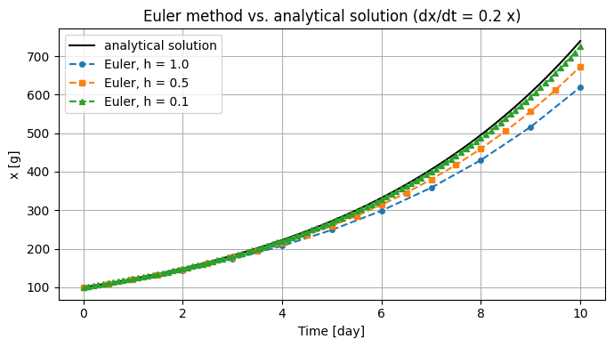

# 第2回　常微分方程式と数値シミュレーション

### 今回の位置付け

1. 現象の理解
2. 仮定の設定
3. 数理モデルの構築
4. <span style="color:red">数値シミュレーション</span>
5. データとの比較
6. パラメタ推定
7. モデルの検証と改善

- 第1回：現象に対する仮定を，差分方程式や微分方程式として記述した．
- 第2回：与えられた微分方程式から，状態変数の時間変化を数値計算する．
- **数値シミュレーション**：数理モデルに基づき，計算機で現象の時間変化を近似的に求めること．上のワークフローの第4段階に当たる．
- 前回との接続：

  - 第1回：増加量が現在量に比例するという仮定から，$\Delta t=1$ 年の差分方程式 $x_{k+1}=x_k+rx_k$ を作り，$\Delta t$ を細かくした極限として $x'=rx$ を得た．
  - 第2回：$x'=rx$ から出発し，刻み幅 $h$ を用いて次の更新式で計算する．第1回の計算は $h=1$ 年の場合に相当する．

$$
x_{k+1} = x_k + h\,r\,x_k
$$

### 到達目標

- 初期値問題：解が微分方程式 $x'=f(t,x)$ と初期条件 $x(t_0)=x_0$ の両方を満たす関数であることを説明できる．
- Euler法の原理：更新式 $x_{k+1}=x_k+h f(t_k,x_k)$ を説明し，手計算で数ステップ実行できる．
- Euler法の実装：Pythonで実装し，刻み幅・誤差・計算量の関係を表と図で示せる．
- `solve_ivp`の利用：初期値問題を解き，結果を解析解やEuler法と比較できる．
- 数値解の評価：解析解との誤差を求め，刻み幅や許容誤差による違いを説明できる．

### なぜ数値的に解く必要があるのか

- **解析解**：解析的な計算によって得られる解
  - 例：$x'=rx$，$x(0)=x_0$ に対する $x(t)=x_0e^{rt}$．
  - 解析的に求める際の制約：仮定を追加した複雑なモデルでは，解を明示的な数式で表すことが難しくなる場合が多い．

| 仮定 | 微分方程式 | 解析的な計算の方法と制約（初期時刻は0） |
| --- | --- | --- |
| 変化率が現在量に比例する | $x' = rx$ | $x_0 e^{rt}$ |
| 一人あたりの増加率が人口に対して線形に減少する | $x' = rx(1 - x/K)$ | 変数分離により解析解を求められる |
| 流入量と放流量を観測データで与える | $V' = Q_{\mathrm{in}}(t) - Q_{\mathrm{out}}(t)$ | 入力を補間し，その時間積分を計算する |
| 捕食によって2つの個体群が相互作用する | $x' = ax - bxy$<br>$y' = -cy + dxy$ | 一般の初期条件に対して，時間の関数としての解を初等関数で表すことは困難である |

- **数値解**：離散的な時刻における解の近似値．これを計算して状態変数の時間変化を調べる．
  - 数値解法の適用対象：観測データを入力とするモデルや，複数の状態変数をもつ連立微分方程式も扱える．

### 準備

````{note} 演習0：作業フォルダとNotebookを作成する

1. ターミナルで次のコマンドを実行し，第2回の作業フォルダを作成せよ．今回は外部データを使用しない．

```bash
mkdir -p ~/applied_programming_ii/02
cd ~/applied_programming_ii/02
mkdir -p notebooks reports/figures
```

2. `notebooks/ode_simulation.ipynb`を新規作成せよ．

3. `02`フォルダに`README.md`を作成し，次のテンプレートを記入せよ．演習・課題の解答欄は，各設問に取り組んだ後で埋めよ．

```markdown
# 応用プログラミングII 第2回

- 氏名：
- 学籍番号：

## 今日の目標

Euler法の原理を説明し，Pythonで初期値問題を数値計算して解析解と比較する．

## 計算条件

- 微分方程式：dx/dt = r x
- パラメタ：r = 0.2
- 初期値：x(0) = 100
- 計算区間：0〜10
- 単位：この計算例では特定の現象を想定せず，単位を設定しない．

## 演習1：手計算の記録

- 計算条件：$x'=0.2x$，$x(0)=100$，刻み幅 $h=0.5$，計算区間 $0\le t\le3$．

| ステップ $k$ | 時刻 $t_k$ | 近似値 $x_k$ | 傾き $0.2x_k$ | 次の近似値 $x_{k+1}=x_k+0.5\times0.2x_k$ |
| ---: | ---: | ---: | ---: | ---: |
| 0 | 0.0 | 100 |  |  |
| 1 | 0.5 |  |  |  |
| 2 | 1.0 |  |  |  |
| 3 | 1.5 |  |  |  |
| 4 | 2.0 |  |  |  |
| 5 | 2.5 |  |  |  |
| 6 | 3.0 |  | — | — |

- $t=3$ での比較

| 刻み幅 $h$ | ステップ数 | 数値解 | 解析解 $100e^{0.6}$ | 絶対誤差 |
| ---: | ---: | ---: | ---: | ---: |
| 1.0 | 3 |  |  |  |
| 0.5 | 6 |  |  |  |

1. 絶対誤差の比（$h=0.5$ の絶対誤差 ÷ $h=1$ の絶対誤差）：
2. 刻み幅を半分にしたときの絶対誤差の変化：

## 演習2：刻み幅と誤差の表

| 刻み幅 h | ステップ数 | x(10)の数値解 | 解析解 | 誤差 |
| --- | --- | --- | --- | --- |

- 大きい刻み幅での数値解と絶対誤差の変化：
- h=0.01からh=0.001にしたときの絶対誤差の比：
- 絶対誤差を10分の1にするために必要なステップ数の倍率：

## 演習3：増殖モデルを solve_ivp で解く

- 計算の成否（sol.success）：
- 時刻の配列の形（sol.t.shape）：
- 解の配列の形（sol.y.shape）：
- solve_ivpの最大絶対誤差（出力時刻上）：

| 解法 | x(20)の数値解 | 解析解 | 誤差（数値解−解析解） | 右辺の評価回数（数値解を求める過程で，微分方程式の右辺の関数値を計算した回数） |
| --- | --- | --- | --- | --- |
| solve_ivp |  |  |  |  |
| Euler法（h=0.01） |  |  |  |  |

- 終了時刻での絶対誤差と右辺の評価回数の比較：

## 課題：減衰モデルの半減期と数値解の比較

### 設問1：減衰モデルの計算

- コードはNotebookに記録する．

### 設問2：半減期

| 減衰率 $\lambda$ [1/時間] | 数値解から読んだ半減期 [時間] | 解析解の半減期 [時間] |
| --- | --- | --- |
| 0.3 |  |  |
| 0.1 |  |  |
| 0.6 |  |  |

- 数値解と解析解から求めた半減期の比較：
- 減衰率を変えたときの半減期の変化：

### 設問3：解法比較の表

| 解法 | 刻み幅 h [時間] | t=24での数値解 | 解析解 | 誤差（数値解−解析解） | 右辺の評価回数 |
| --- | --- | --- | --- | --- | --- |
| Euler法 | 2 |  |  |  |  |
| Euler法 | 1 |  |  |  |  |
| Euler法 | 0.5 |  |  |  |  |
| Euler法 | 0.1 |  |  |  |  |
| solve_ivp | 自動調整 |  |  |  |  |

### 設問4：比較図

- ＜特に記載は不要＞

### 設問5：精度と計算量の比較

- 考察（3行程度）：
```

4. Notebookの最初のコードセルに以下を入力して実行し，NumPy・SciPyのバージョンと作業フォルダが表示されることを確認せよ．今回から`scipy`を使う．

```python
from pathlib import Path

import numpy as np
import matplotlib.pyplot as plt
from scipy.integrate import solve_ivp

plt.rcParams["font.family"] = "Hiragino Sans"  # 日本語表示用（macOS）

import scipy
print("NumPy:", np.__version__)
print("SciPy:", scipy.__version__)

PROJECT_DIR = Path.home() / "applied_programming_ii" / "02"
FIGURE_DIR = PROJECT_DIR / "reports" / "figures"
FIGURE_DIR.mkdir(parents=True, exist_ok=True)

print("作業フォルダ:", PROJECT_DIR)
```

```{dropdown} コードの補足

- `import numpy as np`：NumPyを読み込み，以後は`np`という短い名前で使う．
- `Path.home()`：ホームフォルダの場所．`/ "02"`のように書くと，その下のフォルダやファイルのパスを作れる．
- `.mkdir(parents=True, exist_ok=True)`：必要な親フォルダも含めて作成する．既に存在する場合もエラーにしない．
```

````

## 初期値問題

- **初期値問題**：微分方程式と初期条件をともに満たす関数 $x(t)$ を求める問題．

$$
\left\{
\begin{aligned}
    & \frac{dx}{dt} = f(t, x) \\
    & x(t_0) = x_0
\end{aligned}
\right.
$$

- 微分方程式 $x'=f(t,x)$：各時刻・状態における変化率を規定する．
- 右辺の関数 $f(t,x)$：時刻 $t$ に状態が $x$ であるときの変化率．現象に対する仮定を関数形で表す．
- 初期条件 $x(t_0)=x_0$：初期時刻 $t_0$ の状態を指定する．
- 初期値 $x_0$：初期時刻における状態変数の値．

- 解の存在と一意性（cf. 補遺1）：
  - 微分方程式 $x'=rx$ だけでは，初期値ごとに異なる解が存在する．
  - ここに初期条件を与えると解が一意に定まる．
  - 数理モデルを作成した場合には，解の存在と一意性は成り立っているものとして議論が進められることが多い．

### 例：指数的な増加と減衰

- この節の扱い：解法を学ぶための数学的な例として，$t$ と $x$ に物理的な単位を設定しない．
- 方程式：$x'=rx$．
- 初期条件：$x(t_0)=x_0$．
- 解析解：

$$
x(t) = x_0\,e^{r(t - t_0)}
$$

この解析解はpythonでは次のような関数として実装できる．

```python
def exponential_solution(t, x0, r, t0=0.0):
    """dx/dt = r x, x(t0) = x0 の解析解 x0 * exp(r (t - t0)) を返す．"""
    return x0 * np.exp(r * (t - t0))
```

```{dropdown} コードの補足

- [`np.exp(z)`](https://numpy.org/doc/stable/reference/generated/numpy.exp.html)：指数関数 $e^z$ を計算する．`z`がNumPy配列なら，各要素について計算する．
- `def`と`return`：`def`で関数を定義し，`return`で計算結果を呼び出し元へ返す．
- `t0=0.0`：引数`t0`を省略したときに使う値を指定する．
```

使用例

```python
exponential_solution(t=3.0, x0=100.0, r=0.2)
```

出力
```bash
np.float64(182.21188003905093)
```

- 計算内容：$x(0)=100$，$r=0.2$ のときの $x(3)=100e^{0.6}\approx182.21$．`t0`を省略しているため，初期時刻は0．

````{dropdown} 補足：解析解が初期値問題を満たすことの確認

- 微分方程式の確認：$x(t)=x_0e^{r(t-t_0)}$ を微分する．

$$
\frac{dx}{dt} = x_0\,r\,e^{r(t - t_0)} = r\,x(t)
$$

- 初期条件の確認：$t=t_0$ を代入すると $x(t_0)=x_0e^0=x_0$．

解析解は数値解の精度を確かめる基準として活用できる．
````

解の挙動は$r$の値によって異なる（ただし$x_0>0$とする）
- $r>0$：増加．
- $r<0$：0への減衰．
- $r=0$：一定値．

対応する現象の例

- 増加：増殖初期の微生物の個体数，一人あたりの増加率を一定と仮定した人口．
- 減衰：薬物の血中濃度，放射性物質の量，室温との温度差．

<!--
- 符号付き誤差：数値解から解析解を引いた値．
- 絶対誤差：符号付き誤差の絶対値．
- 基準値の注意点：解析解をPythonで評価した値にも丸め誤差がある．今回比較するEuler法の誤差より十分小さい範囲で用いる．
 -->

## Euler法：解の一次近似による時間発展の計算

### 導出

刻み幅 $h$ を十分小さいものとして，微分係数は差分商によって近似できる．

$$
x'(t) \approx \frac{x(t + h) - x(t)}{h}
$$

これを用いて微分方程式を置き換えれば

$$
\frac{x(t + h) - x(t)}{h} \approx f(t,x(t)).
$$

ここで次の時刻の値（$x(t+h)$）について整理すると

$$
x(t + h) \approx x(t) + h\,f(t, x(t)),
$$

となる．

次の命名規則（notation）に従い記号を定義する．

- 時刻の記号：$t_k=t_0+kh$．
- 近似値の記号：$x_k\approx x(t_k)$．

すると微分方程式は次の漸化式とみなすことができる．

$$
x_{k+1} = x_k + h\,f(t_k, x_k),
\qquad k = 0, 1, 2, \ldots.
$$

初期値 $x_0$ から更新式を繰り返し適用することで，任意の時刻までの $x$ の値を数値的に求めることができる．

```{tip} 注意：近似の正当性
微分方程式に対して $\approx$ で議論したことからも分かる通り，あくまで近似値を計算しているに過ぎない．
この手続きに従って得られる数値解が元の微分方程式の解の近似として妥当かどうかは，

- Euler法の収束定理・誤差評価（適切な条件のもとで，刻み幅 $h$ を0に近づけると数値解が厳密解に近づく）
- 解の存在と一意性

を確認する必要がある．
```
<!-- - 参照先：[NTNUの講義資料：常微分方程式の数値解法の収束](https://wiki.math.ntnu.no/_media/ma2501/2020v/odesconvergence.pdf)． -->

### 具体例に対する手計算による確認

$x' = 0.2\,x$，$x(0) = 100$ を刻み幅 $h = 1$ で3ステップ計算する．

| $k$ | $t_k$ | $x_k$ | 傾き $f(t_k, x_k) = 0.2\,x_k$ | $x_{k+1} = x_k + 1 \times 0.2\,x_k$ |
| ---: | ---: | ---: | ---: | ---: |
| 0 | 0 | 100 | 20 | 120 |
| 1 | 1 | 120 | 24 | 144 |
| 2 | 2 | 144 | 28.8 | 172.8 |
| 3 | 3 | $\color{red}172.8$ |  |  |

- 解析解：$x(3)=100e^{0.6}\approx{\color{red}182.21}$．
- Euler法による数値解：$\color{red}172.8$．解析解より約9.4小さい（絶対誤差は約 $9.4$）．

増加する傾きを区間始点の値で固定するため，過小評価されている．

````{note} 演習1：刻み幅を半分にして手計算する

同じ問題を刻み幅 $h = 0.5$ で $t = 3$ まで（6ステップ）手計算し，`README.md`の「演習1」に表を書け．
電卓を使ってよい．

1. $t=3$ での数値解と絶対誤差を求め，$h=1$ の数値解172.8，解析解 $100e^{0.6}\approx182.21$ とともに`README.md`の比較表に記入せよ．
2. $h=0.5$ の絶対誤差を $h=1$ の絶対誤差で割った比を求め，刻み幅を半分にすると絶対誤差がおよそ何分の1になったかを`README.md`に記述せよ．
````
<!-- 
```{dropdown} 演習1の確認

- 更新式：$x_{k+1}=x_k+0.5\times0.2x_k=1.1x_k$．
- 計算結果：$100\to110\to121\to133.1\to146.41\to161.051\to177.1561$．6ステップ後の $t=3$ で $x_6=177.1561$．
- $t=3$ での絶対誤差：

  - $h=0.5$：$|177.1561-100e^{0.6}|\approx5.06$．
  - $h=1$：$|172.8-100e^{0.6}|\approx9.41$．

- 比較：絶対誤差の比は約 $5.06/9.41\approx0.54$．刻み幅を半分にすると，絶対誤差もおよそ半分になる．Euler法の大域誤差が $O(h)$ となる性質に対応する．
```
 -->

## Pythonによる実装

### Euler法の関数

- 入力：右辺の関数 $f$，計算区間，初期値，刻み幅，パラメタ．
- 処理：手計算と同じ更新式を繰り返す．
- 出力：時刻の配列と近似解の配列．

```python
def euler(rhs, t_span, x0, h, args=()):
    """前進Euler法で初期値問題 x' = rhs(t, x, *args), x(t0) = x0 を解く．

    rhs: 右辺の関数．rhs(t, x, *args) の形で呼び出す．
    t_span: (t0, t_end) 計算区間．
    x0: 初期値（実数のスカラー）．
    h: 正の刻み幅．最後のステップだけ必要に応じて短くする．
    args: rhs に渡すパラメタのタプル．
    戻り値: 時刻の配列 t と近似解の配列 x．
    """
    t0, t_end = t_span
    if h <= 0 or t_end <= t0:
        raise ValueError("h > 0，t_end > t0 を指定してください．")

    # 時間ステップを用意
    n_steps = int(np.ceil((t_end - t0) / h))
    t = t0 + h * np.arange(n_steps + 1)
    t = np.append(t[t < t_end], t_end)
    n_steps = len(t) - 1

    # 解の変数を用意
    x = np.zeros(n_steps + 1)
    x[0] = x0

    # 更新式の計算
    for k in range(n_steps):
        dt = t[k + 1] - t[k]
        x[k + 1] = x[k] + dt * rhs(t[k], x[k], *args)
    return t, x
```

```{dropdown} コードの補足

- `int(np.ceil(...))`：小数部分を切り上げ，整数型に変換する．例：`int(np.ceil(2.3))`は`3`．
- [`np.arange(n_steps + 1)`](https://numpy.org/doc/stable/reference/generated/numpy.arange.html)：0から`n_steps`までの整数を並べた配列．終了値`n_steps + 1`は含まない．
- `t[t < t_end]`：配列`t`から，`t_end`より小さい要素だけを取り出す．`np.append(..., t_end)`で末尾に終了時刻を加える．
- `np.zeros(n_steps + 1)`：全要素が0の配列を用意する．`x[0]`は先頭要素で，添字は0から数える．
- `range(n_steps)`：0から`n_steps - 1`までの整数を順に使い，`for`で更新を繰り返す．
- `args=()`と`*args`：追加パラメタをタプル（値をまとめたもの）で受け取り，`*args`で展開して右辺の関数へ渡す．`args=(r,)`なら`rhs(t[k], x[k], r)`という呼び出しになる．

- 対応する問題：実数の状態変数が1つで，$t_{\mathrm{end}}>t_0$ の初期値問題．
- 終了時刻の処理：区間を $h$ で割り切れない場合は，最後のステップを短くする．

  - 例：区間0〜10，$h=1.2$ では，$t=9.6$ まで1.2刻み，最後は0.4刻み．

- 右辺の関数：`rhs(t, x, パラメタ...)`の形式．`solve_ivp`と共通にする．
- 今回のパラメタ：増加率 $r$．
```

右辺の関数を準備する．

```python
def exponential_rhs(t, x, r):
    """dx/dt = r x の右辺．"""
    return r * x
```

### 解析解との比較

- 初期値：$x(0)=100$
- 増加率：$r=0.2$
- 計算区間：$0\le t\le10$

```python
# パラメタ
r = 0.2          # 増加率

# 初期条件と計算区間
x0 = 100.0       # 初期値
t_span = (0.0, 10.0)   # t = 0 から t = 10 まで

# 刻み幅を変えて計算する
h_values = [1.0, 0.5, 0.1, 0.01]

print(f"{'h':>6} {'ステップ数':>8} {'x(10)の数値解':>14} {'解析解':>10} {'誤差':>10}")
for h in h_values:
    t, x = euler(exponential_rhs, t_span, x0, h, args=(r,))
    exact_end = exponential_solution(t[-1], x0, r)
    error = x[-1] - exact_end
    print(f"{h:6.3f} {len(t) - 1:8d} {x[-1]:14.6f} {exact_end:10.6f} {error:10.6f}")
```

```{dropdown} コードの補足

- `t, x = euler(...)`：関数が返した2つの配列を，それぞれ`t`と`x`で受け取る．
- `x[-1]`と`len(t)`：`x[-1]`は末尾の値，`len(t)`は時刻の個数．初期時刻も含むため，ステップ数は`len(t) - 1`．
- `(r,)`：要素が1つのタプル．末尾のカンマが必要で，`(r)`だけではタプルにならない．
- `f"{error:10.6f}"`：変数の値を文字列に埋め込む書き方．ここでは最小表示幅10文字，小数点以下6桁で表示する．
- `{h:6.3f}`：刻み幅を小数点以下3桁で表示する．演習2で追加する`0.001`を`0.00`に丸めず表示できる．
- 表示の丸め：計算に使う値は変わらない．誤差の比は，表示を丸めた値ではなく計算中の値から求めるとよい．数値1つの絶対値には`abs(error)`を使う．
```

- 誤差：十分小さい刻み幅の範囲では，$h$ を1/10にすると誤差もおよそ1/10．
- 計算量：同じ区間では，ステップ数が10倍．精度の改善には計算量の増加を伴う．

```python
t_fine = np.linspace(t_span[0], t_span[1], 201)
x_exact = exponential_solution(t_fine, x0, r)

fig, ax = plt.subplots(figsize=(7, 4))
ax.plot(t_fine, x_exact, color="black", label="解析解")
for h, marker in zip([1.0, 0.5, 0.1], ["o", "s", "^"]):
    t, x = euler(exponential_rhs, t_span, x0, h, args=(r,))
    ax.plot(t, x, marker=marker, markersize=4, linestyle="--", label=f"Euler, h = {h}")

ax.set_title("Euler法と解析解の比較 (dx/dt = 0.2 x)")
ax.set_xlabel("t")
ax.set_ylabel("x")
ax.grid(True)
ax.legend()
fig.tight_layout()
fig.savefig(FIGURE_DIR / "euler_vs_exact.png", dpi=150)
plt.show()
```

```{dropdown} コードの補足

- [`np.linspace(a, b, n)`](https://numpy.org/doc/stable/reference/generated/numpy.linspace.html)：両端の`a`と`b`を含む，等間隔の`n`個の値を作る．0〜10の201点なら間隔は0.05．
- `zip(...)`：2つの並びから値を組にして取り出す．ここでは刻み幅とマーカーを対応させる．
- `fig, ax = plt.subplots(...)`：図全体を表す`fig`と，グラフを描く領域`ax`を作る．`ax.plot`で描画し，`fig.savefig`で保存する．
```



- 図の結果：今回のEuler法の曲線は，いずれも解析解の下側にある．
- 理由：$x''(t)=r^2x(t)>0$ で増加する変化率を，区間始点の値で近似するため．

````{note} 演習2：刻み幅と誤差の関係を表にする

1. 上のコードで出力した結果を，`README.md`の演習2の表に転記せよ．誤差欄には数値解から解析解を引いた値を記入せよ．
2. `h_values`に`2.0`と`5.0`を追加して実行し，表に追記せよ．刻み幅を大きくしたときの数値解と絶対誤差の変化を，`README.md`に記述せよ．
3. `h_values`に`0.001`を追加して実行し，表に追記せよ．$h=0.001$ の絶対誤差を $h=0.01$ の絶対誤差で割った比を求め，`README.md`に記入せよ．
4. 絶対誤差を10分の1にするために必要なステップ数の倍率を表から見積もり，`README.md`に記入せよ．
````

<!--
````{dropdown} 演習2の解答例

```python
r = 0.2
x0 = 100.0
t_span = (0.0, 10.0)
h_values = [1.0, 0.5, 0.1, 0.01, 2.0, 5.0, 0.001]
exact_end = exponential_solution(t_span[1], x0, r)

print("刻み幅, ステップ数, x(10), 解析解, 誤差")
for h in h_values:
    t, x = euler(exponential_rhs, t_span, x0, h, args=(r,))
    print(f"{h:g}, {len(t) - 1}, {x[-1]:.6f}, {exact_end:.6f}, {x[-1] - exact_end:.6f}")

t_01, x_01 = euler(exponential_rhs, t_span, x0, 0.01, args=(r,))
t_001, x_001 = euler(exponential_rhs, t_span, x0, 0.001, args=(r,))
error_01 = abs(x_01[-1] - exact_end)
error_001 = abs(x_001[-1] - exact_end)
print("絶対誤差の比:", error_001 / error_01)
print("ステップ数の倍率:", (len(t_001) - 1) / (len(t_01) - 1))
```

- `abs(...)`：数値1つの絶対値を求める．
- 表の記入：各行の出力を，対応する刻み幅の行に転記する．
- 大きい刻み幅での変化：$h=2$ では数値解が537.824，$h=5$ では400となる．刻み幅を大きくすると数値解は小さくなり，解析解約738.906との差の絶対値は大きくなる．
- 絶対誤差の比：$h=0.001$ と $h=0.01$ の比は約0.1002．
- 必要なステップ数：1000回から10000回への増加により，絶対誤差が約10分の1になる．必要なステップ数の倍率は約10倍と見積もれる．
````
-->

## `solve_ivp`による数値シミュレーション

### 使い方

- Euler法の制約：高い精度を得るには，小さい刻み幅と多くのステップが必要．
- 実用的な解法：`scipy.integrate.solve_ivp`を使う．
- 既定の方法：Runge–Kutta法の一種であるRK45．導出は本講義の範囲外．
- 刻み幅の調整：各ステップの局所誤差の推定値に基づいて自動調整する．
- 許容誤差：局所誤差の制御に用いる値．計算区間全体の誤差の上限ではない．
- `t_eval`：出力時刻の指定．内部の刻み幅を直接指定するものではない．

```python
# 数値解を出力したい時刻
t_eval = np.linspace(t_span[0], t_span[1], 101)

sol = solve_ivp(exponential_rhs, t_span, [x0], t_eval=t_eval, args=(r,))

print("成功したか:", sol.success)
print("時刻の配列の形:", sol.t.shape)
print("解の配列の形:", sol.y.shape)
print("右辺を評価した回数:", sol.nfev)
```

```{dropdown} コードの補足：計算結果の表示の読み方

- `sol`：`solve_ivp`が返す計算結果．解の配列だけでなく，計算の成否や評価回数（数値解を求める過程で，微分方程式の右辺の関数値を計算した回数）も格納されている．`.`の後に名前を付けて各情報を取り出す．
- `sol.success`：正常終了したかを表す真偽値．今回のように終了イベントを指定しない場合，終了時刻まで計算できれば`True`，途中で計算に失敗すれば`False`．`sol.message`で終了理由を確認できる．`True`だけでは解の精度を保証しない．
- `sol.t.shape`：出力時刻の配列の形．今回は`(101,)`で，101個の時刻をもつ1次元配列を表す．末尾のカンマは，長さ1のタプルを表す記号．
- `sol.y.shape`：数値解の配列の形．今回は`(1, 101)`で，状態変数1個×出力時刻101個を表す．`sol.y[0, j]`は，時刻`sol.t[j]`での $x$ の近似値．
- `sol.nfev`：右辺の関数を評価した回数（number of function evaluations）．ここでは`exponential_rhs(t, x, r)`を呼び出し，変化率 $rx$ を計算した回数．

  - ステップ数との違い：RK45では1ステップで右辺を複数回評価し，刻み幅を変更してやり直す場合もある．そのため，ステップ数とは一致しない．
  - 出力時刻数との違い：`t_eval`の101点は結果を出力する時刻の数であり，`nfev`とは別の値．
  - 用途：計算量の目安．Euler法では今回の実装で1ステップにつき1回評価するため，ステップ数と比較できる．実行時間そのものではない．

- `exponential_rhs`：括弧を付けずに関数そのものを渡す．`solve_ivp`が計算中にこの関数を呼び出す．
```

引数と戻り値の対応を整理する．

| 引数・属性 | 意味 | 今回の値 |
| --- | --- | --- |
| 第1引数 | 右辺の関数 `rhs(t, x, *args)` | `exponential_rhs` |
| 第2引数 `t_span` | 計算区間 $(t_0, t_{\mathrm{end}})$ | `(0.0, 10.0)` |
| 第3引数 | 初期値．状態変数が1つでもリストで渡す | `[x0]` |
| `t_eval` | 解を出力する時刻の配列 | `np.linspace(0, 10, 101)` |
| `args` | 右辺に渡すパラメタのタプル | `(r,)` |
| `sol.t` | 出力時刻の配列 | 長さ101 |
| `sol.y` | 解の配列．行が状態変数，列が時刻 | 形は (1, 101) |
| `sol.y[0]` | 1つ目の状態変数の時系列 | $x(t)$ |

- 配列の次元：状態変数が1つでも，`sol.y`は2次元配列．
- 状態変数が1つの場合：`sol.y[0]`で $x(t)$ の近似値を取り出す．
- 状態変数が2つの場合：`sol.y[0]`と`sol.y[1]`を使う（第10回など）．

### Euler法および解析解との比較

```python
x_ivp = sol.y[0]
x_exact_eval = exponential_solution(sol.t, x0, r)

print(f"solve_ivp の x(10) = {x_ivp[-1]:.4f}")
print(f"解析解の x(10)     = {x_exact_eval[-1]:.4f}")
print(f"誤差               = {x_ivp[-1] - x_exact_eval[-1]:.4f}")
print(f"最大絶対誤差（出力時刻上） = {np.max(np.abs(x_ivp - x_exact_eval)):.4f}")

t_euler, x_euler = euler(exponential_rhs, t_span, x0, 0.01, args=(r,))
print(f"Euler法 h=0.01 の x(10) = {x_euler[-1]:.4f}，ステップ数 = {len(t_euler) - 1}")
```

```{dropdown} コードの解説
- `x_ivp - x_exact_eval`：同じ形のNumPy配列どうしでは，対応する要素ごとに引き算する．
- `np.abs(...)`と`np.max(...)`：各要素の絶対値を求め，その最大値を取り出す．ここでは出力時刻上の最大絶対誤差になる．
```

- 今回の結果：`solve_ivp`は右辺の評価が数十回で，Euler法1000ステップより小さい誤差．
- 比較の範囲：今回の方程式・計算条件での結果．一般の問題で同じ効率を保証するものではない．
- 今後の使い分け：実際の計算には原則`solve_ivp`，原理の理解にはEuler法を用いる．
- 注意が必要な例：観測データの補間など，右辺が滑らかでない場合（第6回）．

```{tip} 許容誤差の指定

- 相対許容誤差：`rtol`．既定値は`1e-3`．
- 絶対許容誤差：`atol`．既定値は`1e-6`．
- 判定基準：状態変数が1つなら，局所誤差の推定値を`atol + rtol * abs(x)`と比較する．
- 指定例：`solve_ivp(..., rtol=1e-8, atol=1e-10)`．許容誤差を小さくすると，一般に評価回数が増える．
- 精度の確認：解析解との比較，または許容誤差を小さくした再計算．
- 参照先：[SciPy公式ドキュメント](https://docs.scipy.org/doc/scipy/reference/generated/scipy.integrate.solve_ivp.html)．
```

````{note} 演習3：増殖モデルを solve_ivp で解く

これまでの増殖モデルについて，パラメタ・初期値・計算時間範囲の値を変えた場合について以下の問いに答えよ．
設定は $x'=0.5x$，$x(0)=30$ を区間 $0\le t\le20$ で計算するものとする．

1. `solve_ivp`で解け．出力時刻には`np.linspace(0.0, 20.0, 201)`を指定し，許容誤差は既定値を用いよ．計算の成否，時刻と解の配列の形を`README.md`に記入せよ．
2. 解析解を求め，数値解と解析解を同じ図に描け．凡例と軸ラベルを付けよ．
3. $t=20$ での数値解・解析解・誤差（数値解−解析解）・右辺の評価回数を`README.md`の演習3の表に記入せよ．出力時刻上の最大絶対誤差も求め，記入せよ．
4. Euler法（$h=0.01$）の結果を同じ表に記入し，終了時刻での絶対誤差と右辺の評価回数を比較して記述せよ．
````

<!--
````{dropdown} 演習3の解答例

解析解は $x(t)=x(0)e^{rt}$ に $r=0.5$，$x(0)=30$ を代入して，$x(t)=30e^{0.5t}$ となる．

```python
r = 0.5
x0 = 30.0
t_span = (0.0, 20.0)
t_eval = np.linspace(0.0, 20.0, 201)
sol = solve_ivp(exponential_rhs, t_span, [x0], t_eval=t_eval, args=(r,))
x_exact_eval = exponential_solution(sol.t, x0, r)

print("成功したか:", sol.success)
print("時刻の配列の形:", sol.t.shape)
print("解の配列の形:", sol.y.shape)
print("解法, x(20), 解析解, 誤差, 右辺の評価回数")
print("solve_ivp", sol.y[0, -1], x_exact_eval[-1],
      sol.y[0, -1] - x_exact_eval[-1], sol.nfev)
print("最大絶対誤差（出力時刻上）:", np.max(np.abs(sol.y[0] - x_exact_eval)))

t_euler, x_euler = euler(exponential_rhs, t_span, x0, 0.01, args=(r,))
print("Euler法", x_euler[-1], x_exact_eval[-1],
      x_euler[-1] - x_exact_eval[-1], len(t_euler) - 1)

print("solve_ivpの終了時刻の絶対誤差:", abs(sol.y[0, -1] - x_exact_eval[-1]))
print("Euler法の終了時刻の絶対誤差:", abs(x_euler[-1] - x_exact_eval[-1]))

fig, ax = plt.subplots(figsize=(7, 4))
ax.plot(sol.t, x_exact_eval, color="black", label="解析解")
ax.plot(sol.t, sol.y[0], linestyle="--", label="solve_ivp")
ax.set_xlabel("t")
ax.set_ylabel("x")
ax.legend()
ax.grid(True)
fig.tight_layout()
fig.savefig(FIGURE_DIR / "growth_solve_ivp.png", dpi=150)
plt.show()
```

- 計算結果：正常終了した場合，`sol.success`は`True`，`sol.t.shape`は`(201,)`，`sol.y.shape`は`(1, 201)`．
- 解析解：$x(20)=30e^{10}\approx660793.973844$．
- Euler法（$h=0.01$）：$x(20)\approx644532.420699$，誤差は約 $-16261.553146$，右辺の評価回数は2000回．
- `solve_ivp`の記録：上のコードが出力する終了時刻の数値解・誤差・右辺の評価回数を表に記入し，出力時刻上の最大絶対誤差を別欄に記入する．終了時刻の絶対誤差と出力時刻上の最大絶対誤差は区別する．
- 比較：両解法の終了時刻の絶対誤差と評価回数を比較する．今回の条件では，`solve_ivp`の方が少ない評価回数で小さい絶対誤差を得られる．
- 注意：`solve_ivp`の数値や評価回数は，SciPyのバージョンにより異なる場合がある．
````
-->

## 課題

````{dropdown} コードの補足：条件を満たす最初の出力時刻

本文の増殖モデルについて，数値解が初期値の2倍以上になる最初の出力時刻を求める例を示す．増殖モデルを解いた直後の`sol`と`x0`を用いる．

```python
indices = np.flatnonzero(sol.y[0] >= 2.0 * x0)
if indices.size > 0:
    first_index = indices[0]
    print("初めて条件を満たす出力時刻:", sol.t[first_index])
else:
    print("計算区間内の出力時刻では条件を満たしません．")
```

- `sol.y[0] >= 2.0 * x0`：各出力時刻の数値解が条件を満たすかを判定する．
- `np.flatnonzero(...)`：条件が`True`となる位置の添字を配列で返す．`indices[0]`は最初の添字．
- `indices.size`：添字の個数．0のときは`indices[0]`を取り出せないため，`if`で確認する．`else`は条件を満たさない場合の処理．
- 課題への変更：比較を`<=`に，しきい値を初期値の半分に変え，減衰モデルの計算結果に適用する．
- `np.log(2)`：自然対数 $\ln2$．解析解の半減期 $\ln2/\lambda$ は`np.log(2) / decay_rate`で求める．
- 出力間隔の影響：取得するのは条件を満たす最初の**出力時刻**であり，濃度が厳密に半分になる時刻とは限らない．
````

````{warning} 課題：減衰モデルの半減期と数値解の比較

薬を服用した後の血中濃度のように，現在量に比例して減る現象を考える．

$$
\frac{dx}{dt}=-\lambda x,\qquad x(0)=100
$$

減衰率を $\lambda$ と表し，Pythonでは`decay_rate`という変数名を用いる．計算区間は0〜24時間，濃度は任意単位とする．`solve_ivp`の出力時刻には`np.linspace(0.0, 24.0, 241)`を指定し，許容誤差は既定値を用いよ．プログラムと図はNotebookに，表と考察は`README.md`に記録せよ．数値解・解析解・誤差は，本文の`{error:10.6f}`と同様に小数点以下6桁で表示せよ．

1. 右辺の関数`decay_rhs(t, x, decay_rate)`を定義し，$\lambda=0.3$ /時間として`solve_ivp`で解け．この計算結果は設問3・4でも使用せよ．
2. $\lambda=0.3,0.1,0.6$ /時間のそれぞれについて，数値解が初期値の半分以下となる最初の出力時刻と，解析解の半減期 $\ln2/\lambda$ を半減期の表に記入せよ．数値解から求めた半減期と解析解との差，および $\lambda$ と半減期の関係を説明せよ．
3. $\lambda=0.3$ /時間としてEuler法を刻み幅 $h=2,1,0.5,0.1$ 時間で実行せよ．各刻み幅と設問1の`solve_ivp`について，$t=24$ での数値解・解析解 $100e^{-0.3\times24}$・誤差（数値解−解析解）・右辺の評価回数を解法比較の表に記入せよ．Euler法の評価回数はステップ数，`solve_ivp`の評価回数は`sol.nfev`を用いよ．
4. $\lambda=0.3$ /時間の解析解・Euler法（$h=2$ と $h=0.1$）・`solve_ivp`の結果を1枚の図に描き，`reports/figures/`に保存せよ．線種とマーカーで解法を区別し，凡例と単位付きの軸ラベルを付けよ．
5. 設問3・4の表と図に基づき，Euler法と`solve_ivp`の絶対誤差・右辺の評価回数の違いを3行程度で説明せよ．
````

<!--
````{dropdown} 課題の解答例

**設問1：減衰モデルの計算**

```python
def decay_rhs(t, x, decay_rate):
    return -decay_rate * x

decay_rate = 0.3
x0_decay = 100.0
t_span_decay = (0.0, 24.0)
t_eval_decay = np.linspace(0.0, 24.0, 241)
sol_decay = solve_ivp(decay_rhs, t_span_decay, [x0_decay],
                      t_eval=t_eval_decay, args=(decay_rate,))
```

**設問2：半減期**

```python
print("減衰率, 数値解から読んだ半減期, 解析解の半減期")
for decay_rate in [0.3, 0.1, 0.6]:
    # 設問1の結果を残し，減衰率を変更した結果は別の変数に保存する
    sol_half = solve_ivp(decay_rhs, t_span_decay, [x0_decay],
                         t_eval=t_eval_decay, args=(decay_rate,))
    indices = np.flatnonzero(sol_half.y[0] <= 0.5 * x0_decay)
    if indices.size > 0:
        print(decay_rate, sol_half.t[indices[0]], np.log(2) / decay_rate)
    else:
        print(decay_rate, "計算区間内の出力時刻では半分以下になりません．")
```

| 減衰率 $\lambda$ [1/時間] | 数値解から読んだ半減期 [時間] | 解析解の半減期 [時間] |
| --- | --- | --- |
| 0.3 | 2.4 | 約2.3105 |
| 0.1 | 7.0 | 約6.9315 |
| 0.6 | 1.2 | 約1.1552 |

- 解析解との差：上の順に約0.0895，0.0685，0.0448時間．出力時刻を0.1時間間隔に限定した影響と，数値解自体の誤差を含む．
- 減衰率との関係：解析解の半減期は $\lambda$ に反比例し，$\lambda$ を2倍にすると半減期は半分になる．

**設問3：解法比較の表**

```python
decay_rate = 0.3
exact_end = x0_decay * np.exp(-decay_rate * t_span_decay[1])
print("解法, 刻み幅, x(24), 解析解, 誤差, 右辺の評価回数")
for h in [2.0, 1.0, 0.5, 0.1]:
    t, x = euler(decay_rhs, t_span_decay, x0_decay, h, args=(decay_rate,))
    print(f"Euler法, {h:g}, {x[-1]:.6f}, {exact_end:.6f}, "
          f"{x[-1] - exact_end:.6f}, {len(t) - 1}")

print(f"solve_ivp, 自動調整, {sol_decay.y[0, -1]:.6f}, {exact_end:.6f}, "
      f"{sol_decay.y[0, -1] - exact_end:.6f}, {sol_decay.nfev}")
```

出力された数値を，対応する解法・刻み幅の行に転記する．

**設問4：比較図**

```python
fig, ax = plt.subplots(figsize=(7, 4))
ax.plot(sol_decay.t, x0_decay * np.exp(-decay_rate * sol_decay.t),
        color="black", label="解析解")
for h, marker in zip([2.0, 0.1], ["o", "s"]):
    t, x = euler(decay_rhs, t_span_decay, x0_decay, h, args=(decay_rate,))
    ax.plot(t, x, linestyle=":", marker=marker, markersize=3,
            label=f"Euler法 h={h:g}")
ax.plot(sol_decay.t, sol_decay.y[0], linestyle="--", label="solve_ivp")
ax.set_xlabel("時間 [時間]")
ax.set_ylabel("濃度 [任意単位]")
ax.legend()
ax.grid(True)
fig.tight_layout()
fig.savefig(FIGURE_DIR / "decay_comparison.png", dpi=150)
plt.show()
```

**設問5：精度と計算量の比較**

- Euler法：刻み幅を小さくすると絶対誤差が減少する一方，右辺の評価回数は12，24，48，240回と増える．
- `solve_ivp`：今回の条件では，終了時刻の絶対誤差が約0.000265，右辺の評価回数が62回となり，Euler法（$h=0.1$）よりも両者が小さい．数値や評価回数はSciPyのバージョンにより異なる場合がある．
- 計算量の比較：右辺の評価回数は計算量の目安であり，実行時間そのものではない．
````
-->

### 提出先・期限

- 提出場所：WebClass「第2回課題」
- 提出物：
  - `README.md`
  - Notebookファイル`ode_simulation.ipynb`
- 提出期限：2026年10月10日(土)23:59

## まとめ

- 初期値問題：微分方程式 $x'=f(t,x)$ と初期条件 $x(t_0)=x_0$ をともに満たす関数を求める問題．
- Euler法：$x_{k+1}=x_k+h f(t_k,x_k)$ で近似値を逐次計算する．

  - 精度：十分滑らかな解とLipschitz条件のもとで，固定区間上の大域打ち切り誤差は $O(h)$．
  - 計算量：刻み幅を半分にすると，ステップ数はおよそ2倍．

- `solve_ivp`：既定ではRK45と刻み幅の自動調整を使用．

  - 呼び出し方：`solve_ivp(rhs, t_span, [x0], t_eval=t_eval, args=(パラメタ,))`．
  - 解の取り出し：`sol.y[0]`．
  - 精度の確認：解析解や許容誤差を変えた結果との比較．

- 数値解の評価：誤差（数値解−解析解）の絶対値と右辺の評価回数を比較し，精度と計算量の関係を確認する．

## 補遺1：解の存在と一意性

- **存在**：初期値問題を満たす解が1つ以上あること．
- **一意性**：初期値問題を満たす解が1つ以下あること．
- 数値計算との関係：近似する対象が存在して一意に定まるとき，数値計算結果は元の微分方程式の解を十分近似できていると評価できる．

```{important} 定理（Picard–Lindelöfの定理）

$a,b>0$ とし，長方形領域

$$
D = \{(t, x) : |t - t_0| \le a,\ |x - x_0| \le b\}
$$

上の実数値関数 $f$ が連続で，$x$ に関してLipschitz連続であり，そのLipschitz定数は $t$ に依らないものとする．
このとき，ある $\alpha\in(0,a]$ が存在し，初期値問題

$$
\left\{
\begin{aligned}
    &\frac{dx}{dt} = f(t, x) \\
    &x(t_0) = x_0
\end{aligned}
\right.
$$

は区間 $I=[t_0-\alpha,t_0+\alpha]$ 上に，グラフが $D$ に含まれる解をただ1つもつ．

```

- $x$ に関してLipschitz連続であり，そのLipschitz定数は$t$に依らない：$t$ に依存しない定数 $L\ge0$ が存在し，任意の $(t,x_1),(t,x_2)\in D$ に対して次の不等式が成り立つこと．

$$
|f(t,x_1)-f(t,x_2)|\le L|x_1-x_2|
$$

- Lipschitz定数 $L$：$x$ の変化に対する $f$ の変化の割合の上限．一様であれば全ての $t$ に共通の値を用いる．
<!-- - 存在区間の具体的な選び方：$f$ の連続性と $D$ のコンパクト性から $M=\max_{(t,x)\in D}|f(t,x)|$ は有限であり，次の $\alpha$ を選べる．以下の証明でもこの値を用いる． -->
<!-- 
$$
\alpha=
\begin{cases}
\min\{a,b/M\}, & M>0, \\
a, & M=0
\end{cases}
$$

- $L$ の求め方：$f$ と $\partial f/\partial x$ が $D$ 上で連続なら，平均値の定理により $L=\max_D|\partial f/\partial x|$．偏導関数の絶対値を用いる． -->
- 今回の例：$f(t,x)=rx$ では $|rx_1-rx_2|=|r||x_1-x_2|$ より $L=|r|$．
<!-- - 局所存在と全区間での存在の違い：

  - 定理の保証：初期時刻の近傍での存在・一意性．任意の終了時刻までの存在ではない．
  - 有限時刻で発散する例：$x'=x^2$，$x(0)=1$ の解 $x(t)=1/(1-t)$ は，$t\to1$ で発散する．
  - 今回の指数モデル：解析解により，全時刻での存在を確認できる． -->

- 参考：[Carnegie Mellon大学の微分方程式講義ノート](https://www.math.cmu.edu/~gautam/c/2026-632/notes/existence.html)．
<!-- 
````{dropdown} 証明（Picardの逐次近似法）

**1. 積分方程式への書き換え**

- 前提：$f$ は連続，$x(t)$ は連続関数．
- 同値な表現：初期値問題の解であることと，次の積分方程式を満たすことは同値．

$$
x(t) = x_0 + \int_{t_0}^{t} f(s, x(s))\,ds
$$

- 微分方程式から積分方程式へ：両辺を $t_0$ から $t$ まで積分し，初期条件を使う．
- 積分方程式から微分方程式へ：被積分関数の連続性と微分積分学の基本定理から，$x'=f(t,x)$．
- 初期条件：$t=t_0$ を代入すると $x(t_0)=x_0$．

**2. 完備距離空間の設定**

- 区間：$I=[t_0-\alpha,t_0+\alpha]$．
- 関数の集合：

$$
X = \left\{ x \in C(I) \ :\ \max_{t \in I} |x(t) - x_0| \le b \right\}
$$

- 一様ノルム：$\|x\|=\max_{t\in I}|x(t)|$．このノルムに関して $C(I)$ は完備．
- $X$ の完備性：完備な空間 $C(I)$ の閉部分集合なので，$X$ も完備距離空間．

**3. 写像 $T$ が $X$ を $X$ に移すこと**

- 写像の定義：$x\in X$ に対して，

$$
(Tx)(t) = x_0 + \int_{t_0}^{t} f(s, x(s))\,ds
$$

- 積分の評価：$(s,x(s))\in D$ より $|f(s,x(s))|\le M$．したがって，

$$
|(Tx)(t) - x_0| \le \left| \int_{t_0}^{t} |f(s, x(s))|\,ds \right| \le M\,|t - t_0| \le M\alpha \le b
$$

- 最後の不等式：$M>0$ なら $\alpha\le b/M$，$M=0$ なら $M\alpha=0$．
- 結論：$Tx$ は連続で $\max_{t\in I}|(Tx)(t)-x_0|\le b$ を満たすので，$Tx\in X$．

**4. 反復回数に関する評価**

- 示す不等式：$x,y\in X$，$n\ge0$ に対して，

$$
|(T^n x)(t) - (T^n y)(t)| \le \frac{L^n\,|t - t_0|^n}{n!}\,\|x - y\|
$$

- 証明方法：$n$ に関する数学的帰納法．
- $n=0$：右辺の係数を1と解釈する．一様ノルムの定義より $|x(t)-y(t)|\le\|x-y\|$．
- $n$ から $n+1$：帰納法の仮定とLipschitz条件を使う．

$$
\begin{aligned}
|(T^{n+1} x)(t) - (T^{n+1} y)(t)|
&\le \left| \int_{t_0}^{t} \left| f(s, (T^n x)(s)) - f(s, (T^n y)(s)) \right| ds \right| \\
&\le L \left| \int_{t_0}^{t} |(T^n x)(s) - (T^n y)(s)|\,ds \right| \\
&\le L \left| \int_{t_0}^{t} \frac{L^n |s - t_0|^n}{n!}\,\|x - y\|\,ds \right|
= \frac{L^{n+1}\,|t - t_0|^{n+1}}{(n+1)!}\,\|x - y\|
\end{aligned}
$$

- 結論：$n+1$ でも成立するため，全ての $n\ge0$ で成り立つ．

**5. 不動点の存在と一意性**

- 一様ノルムでの評価：4の不等式で $t\in I$ に関する最大値をとる．

$$
\|T^n x - T^n y\| \le \frac{(L\alpha)^n}{n!}\,\|x - y\|
$$

- 縮小性：$(L\alpha)^n/n!\to0$ より，十分大きい $n$ では $T^n$ が縮小写像になる．
- $T^n$ の不動点：Banachの不動点定理より，唯一の不動点 $x^{*}$ が存在する．
- $T$ の不動点：$T^n(Tx^{*})=T(T^n x^{*})=Tx^{*}$ なので，$Tx^{*}$ も $T^n$ の不動点．一意性から $Tx^{*}=x^{*}$．
- $T$ の不動点の一意性：$T$ の不動点は $T^n$ の不動点でもあるため，$x^{*}$ 以外には存在しない．
- 初期値問題の解：$x^{*}$ は積分方程式の唯一の解であり，1の同値性から初期値問題の唯一の解である．$\blacksquare$

**補足：$x' = rx$ での逐次近似**

- 設定：$f(t,x)=rx$，$t_0=0$．
- 反復：定数関数 $x_0(t)\equiv x_0$ から出発し，$x_{n+1}=Tx_n$ を繰り返す．
- $n$ 回目の近似：

$$
x_n(t) = x_0 \sum_{k=0}^{n} \frac{(rt)^k}{k!}
$$

- 極限：$n\to\infty$ で指数関数の級数展開となり，解析解 $x_0e^{rt}$ に一致する．
````
 -->

## 自主学習用の発展問題

以下は，演習1〜3と課題を終えた学生向けの任意問題である．取り組む場合は，数式・説明・コード・図をNotebookに記録せよ．

````{note} 発展問題1：Runge–Kutta法の導出

Euler法は区間始点の傾き $f(t_k,x_k)$ だけを使う．ここでは区間途中の傾きも使い，同じ刻み幅での精度を上げる方法を考える．2次のRunge–Kutta法（中点法）は，次の2段階の傾きの計算により近似値を更新する．

$$
\left\{
\begin{aligned}
k_1 &= f(t_k,\ x_k) \\
k_2 &= f\!\left(t_k + \tfrac{h}{2},\ x_k + \tfrac{h}{2}\,k_1\right) \\
x_{k+1} &= x_k + h\,k_2
\end{aligned}
\right.
$$

ここで，$k_1$ は始点の傾きであり，中点での状態を $x_k+(h/2)k_1$ と予測するために使う．$k_2$ は予測した中点での傾きであり，$x_{k+1}=x_k+hk_2$ の更新に使う．

局所誤差を調べるため $x_k=x(t_k)$ とおき，$f$ と解が必要な回数だけ連続微分可能であると仮定する．以下の展開式では，右辺の $f$ とその偏導関数は $(t_k,x_k)$ での値とする．

1. $x(t_k+h)$ を $h$ について2次までTaylor展開し，$x''=f_t+f_xf$ を使って，次の式が成り立つことを示せ．

   $$
   x(t_k+h)=x_k+hf+\frac{h^2}{2}(f_t+f_xf)+O(h^3)
   $$

2. $k_2$ を2変数のTaylor展開で $h$ の1次まで展開し，更新式が設問1の展開式の $h^2$ の項まで一致することを示せ．この結果から，局所打ち切り誤差が $O(h^3)$ となることを説明せよ．
3. 本文の`euler`関数にならって`rk2(rhs, t_span, x0, h, args=())`を実装せよ．
4. $x'=0.2x$，$x(0)=100$，計算区間 $0\le t\le10$ について，$h=1,0.5,0.1,0.01$ でEuler法とRK2を実行せよ．$t=10$ での絶対誤差を求め，横軸を刻み幅，縦軸を絶対誤差として`ax.loglog`で両対数グラフに描け．
5. 設問4の両対数グラフの傾きがEuler法で約1，RK2で約2になることを確認し，この傾きが収束次数に対応する理由を説明せよ．
6. 同じ問題を`solve_ivp`の既定のRK45で解き，$t=10$ での絶対誤差と`sol.nfev`を記録せよ．同程度以下の絶対誤差を得るRK2の刻み幅を探し，必要なステップ数と右辺の評価回数をRK45と比較せよ．RK2では1ステップにつき右辺を2回評価する．

十分な滑らかさとLipschitz条件のもとで，RK2の固定した有限区間上の大域打ち切り誤差は $O(h^2)$ となる．

- 局所打ち切り誤差：ここでは，厳密解から1ステップ進めたときに生じる誤差を指す．
- 大域打ち切り誤差：丸め誤差を無視したときの，初期時刻から繰り返し計算した近似値と厳密解との差．
- 収束次数：刻み幅 $h$ を小さくしたとき，大域打ち切り誤差が $O(h^p)$ となる場合の次数 $p$．
````

````{dropdown} コードの補足：RK2の実装と誤差の描画

`euler`関数をコピーして名前を`rk2`に変更し，更新式のループを次のコードに置き換える．時刻配列の準備や戻り値は変更しない．

```python
for k in range(n_steps):
    dt = t[k + 1] - t[k]
    k1 = rhs(t[k], x[k], *args)
    k2 = rhs(t[k] + dt / 2, x[k] + dt * k1 / 2, *args)
    x[k + 1] = x[k] + dt * k2
```

`k1`と`k2`は数式の $k_1,k_2$ に対応する．終了時刻に合わせて最後のステップを短くする場合にも対応するため，刻み幅には`dt`を使う．

`rk2`の定義後に，本文の誤差計算と描画を次のように組み合わせる．

```python
r = 0.2
x0 = 100.0
t_span = (0.0, 10.0)
h_values = [1.0, 0.5, 0.1, 0.01]
errors_euler = np.zeros(len(h_values))
errors_rk2 = np.zeros(len(h_values))
exact_end = exponential_solution(t_span[1], x0, r)

for j in range(len(h_values)):
    h = h_values[j]
    t, x = euler(exponential_rhs, t_span, x0, h, args=(r,))
    errors_euler[j] = abs(x[-1] - exact_end)
    t, x = rk2(exponential_rhs, t_span, x0, h, args=(r,))
    errors_rk2[j] = abs(x[-1] - exact_end)

fig, ax = plt.subplots(figsize=(7, 4))
ax.loglog(h_values, errors_euler, marker="o", label="Euler法")
ax.loglog(h_values, errors_rk2, marker="s", label="RK2")
ax.set_xlabel("刻み幅 h")
ax.set_ylabel("t=10での絶対誤差")
ax.legend()
ax.grid(True)
plt.show()
```

- `errors_euler[j]`：`h_values[j]`に対応する絶対誤差を保存する．時刻ごとの近似値を`x`に保存したのと同じ配列の使い方．
- `ax.loglog(...)`：`ax.plot(...)`と同様に値を渡し，両方の軸を対数目盛にする．ここでは刻み幅と絶対誤差がともに正であることを前提とする．
- 傾きの確認：隣り合う2点について，`np.log(errors_euler[j + 1] / errors_euler[j]) / np.log(h_values[j + 1] / h_values[j])`で計算できる．`j`は0から`len(h_values) - 2`までとし，RK2では誤差の配列名を変更する．
````

### Euler法の不安定性

$x'=-\lambda x$，$\lambda>0$，$x(0)>0$ を，一定の刻み幅 $h>0$ のEuler法で解く場合を考える．更新式は $x_{n+1}=(1-h\lambda)x_n$ となる．$h\lambda>2$ なら $|1-h\lambda|>1$ であるため，数値解の符号は交互に変わり，絶対値は増大する．解析解が単調に減衰するのに対し，この数値解は発散する．ここでは，ステップの添字を $n$ と表す．

````{dropdown} 発展演習：Euler法の不安定性

```python
decay_rate = 2.0
x0_decay = 100.0
t_span_decay = (0.0, 10.0)

fig, ax = plt.subplots(figsize=(7, 4))
t_fine = np.linspace(0.0, 10.0, 201)
ax.plot(t_fine, x0_decay * np.exp(-decay_rate * t_fine), color="black", label="analytical solution")
for h in [0.4, 0.9, 1.2]:
    t, x = euler(decay_rhs, t_span_decay, x0_decay, h, args=(decay_rate,))
    ax.plot(t, x, marker="o", markersize=3, linestyle="--", label=f"Euler, h = {h} (h * decay_rate = {h * decay_rate:.1f})")
ax.set_title("Euler method for dx/dt = -2 x with large step sizes")
ax.set_xlabel("Time [arbitrary unit]")
ax.set_ylabel("x [arbitrary unit]")
ax.set_ylim(-300, 300)
ax.grid(True)
ax.legend()
fig.tight_layout()
fig.savefig(FIGURE_DIR / "euler_instability.png", dpi=150)
plt.show()
```

1. 上のコードを実行し，$0<h\lambda<1$，$1<h\lambda<2$，$h\lambda>2$ で数値解の符号と絶対値がどう変化するかを説明せよ．境界の $h\lambda=1$ と $h\lambda=2$ についても更新式から結果を求めよ．最後に刻み幅を短くするステップでは，実際の刻み幅を用いよ．
2. 同じ問題を`solve_ivp`で解き，出力時刻上の最大絶対誤差を求めて記録せよ．
3. $\lambda$ が大きいほどEuler法で小さい刻み幅が必要になる理由を，増幅率 $1-h\lambda$ を用いて説明せよ．

- 増幅率：1ステップ前の近似値に掛ける係数．この減衰モデルに対するEuler法では $1-h\lambda$．
````

刻み幅を選ぶ際は，解析解の挙動を数値解が再現できるかに注意する．`solve_ivp`を使う場合にも，計算の成功・失敗と，許容誤差を変更したときの結果の変化を確認する必要がある．

````{note} 発展問題2：後退Euler法と数値的安定性

これまで用いた前進Euler法は始点の傾きを使い，上の減衰モデルでは $h\lambda>2$ で数値解が発散する．これに対して，後退Euler法（陰的Euler法）は終点の傾きを使い，次の更新式で近似値を求める．ここでも，ステップの添字を $n$ とする．

$$
x_{n+1} = x_n + h\,f(t_{n+1},\ x_{n+1})
$$

一般には，各ステップで未知値 $x_{n+1}$ に関する代数方程式を解く必要があり，計算量はその求解方法にも依存する．

1. $f(t,x)=-\lambda x$ の場合に上の式を $x_{n+1}$ について解き，$x_{n+1}=x_n/(1+h\lambda)$ となることを示せ．
2. 任意の一定の刻み幅 $h>0$，$\lambda>0$ に対して $0<1/(1+h\lambda)<1$ であることから，初期値が正なら数値解が単調に減少して0に近づくことを示せ．前進Euler法の増幅率 $1-h\lambda$ と比較し，安定となる刻み幅の条件の違いを述べよ．
3. この減衰モデルに対する後退Euler法を実装し，$x'=-2x$，$x(0)=100$，計算区間0〜10について $h=0.4,0.9,1.2$ で計算せよ．解析解とともに描き，前進Euler法の図と並べて示せ．
4. $h=1.2$ で計算した $t=10$ の絶対誤差を求め，安定性と近似精度が別の性質であることを説明せよ．後退Euler法はこの減衰問題で任意の $h>0$ に対して安定だが，大域打ち切り誤差は前進Euler法と同じ $O(h)$ である．
5. $\lambda$ を大きくし，`solve_ivp`のRK45と`method="Radau"`，`method="BDF"`で計算せよ．各解法には同じ $\lambda$・許容誤差・計算区間・出力時刻を指定せよ．使用した条件と，出力時刻上の最大絶対誤差・`sol.nfev`を表にまとめ，比較せよ．

陰的解法には行列の分解なども必要となるため，`sol.nfev`だけでは計算費用全体を比較できない．

- 陰的な方法：次の時刻の未知値を右辺にも含む更新式を用いる方法．後退Euler法では $x_{n+1}$ に関する方程式を解く．
- 硬い問題（stiff problem）：精度のために必要な刻み幅よりも，陽的解法の安定性のために著しく小さい刻み幅が必要な問題．典型例は速く減衰する成分と遅い成分が共存する問題であり，単一の減衰モデルでも急減後の長い区間の計算で同様の制約が現れる．
````

````{dropdown} コードの補足：後退Euler法と解法の切り替え

減衰モデル専用の後退Euler法は，本文の`euler`関数をコピーし，関数名を`backward_euler_decay`，引数を`(t_span, x0, h, decay_rate)`に変更して作成できる．ループ内の更新式を`x[k + 1] = x[k] / (1 + dt * decay_rate)`に置き換え，他の処理はそのまま使う．`backward_euler_decay(t_span_decay, x0_decay, h, decay_rate)`と呼び出せば，本文と同じように時刻と数値解を受け取れる．ここで`decay_rate`は減衰率であり，ループの添字`k`と区別するための名前である．

`solve_ivp`の解法は`method`で切り替える．課題の設問1で定義した`decay_rhs`を用い，例えば次のように同じ条件で比較できる．

```python
decay_rate = 20.0
x0_decay = 100.0
t_span_decay = (0.0, 10.0)
t_eval_decay = np.linspace(0.0, 10.0, 1001)
rtol = 1e-3
atol = 1e-6
print("decay_rate, rtol, atol, 計算区間:", decay_rate, rtol, atol, t_span_decay)

for method in ["RK45", "Radau", "BDF"]:
    sol = solve_ivp(decay_rhs, t_span_decay, [x0_decay],
                    t_eval=t_eval_decay, args=(decay_rate,), method=method,
                    rtol=rtol, atol=atol)
    x_exact = x0_decay * np.exp(-decay_rate * sol.t)
    max_error = np.max(np.abs(sol.y[0] - x_exact))
    print(method, "成功したか:", sol.success,
          "最大絶対誤差（出力時刻上）:", max_error,
          "右辺の評価回数:", sol.nfev)
```

- `method=method`：左側は`solve_ivp`の引数名，右側はループで取り出した文字列を保持する変数．
- RK45：本文で用いた陽的Runge–Kutta法．
- Radau：陰的Runge–Kutta法の一種．硬い問題に用いられる．
- BDF：過去の複数の時刻の近似値を利用する陰的な方法．硬い問題に用いられる．

ここではRadauとBDFの実装や導出は求めず，解法を切り替えて結果を比較する．各解法の説明は[SciPy公式ドキュメント](https://docs.scipy.org/doc/scipy/reference/generated/scipy.integrate.solve_ivp.html)を参照できる．
````
