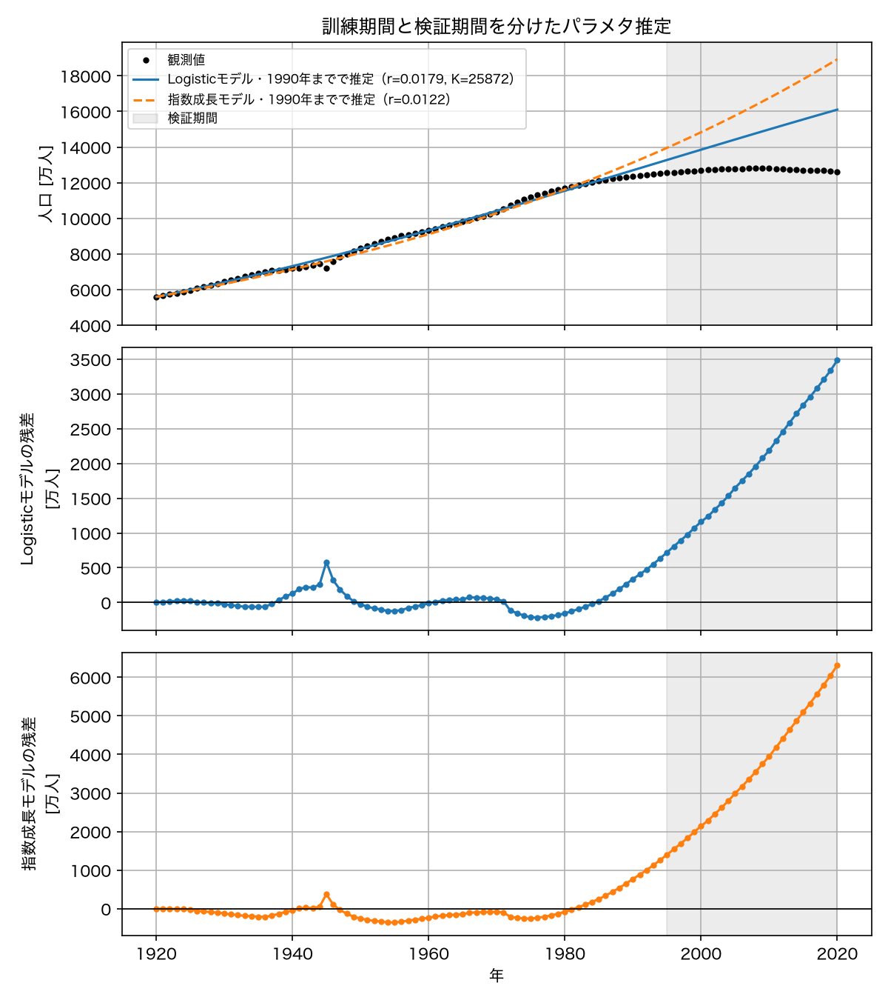
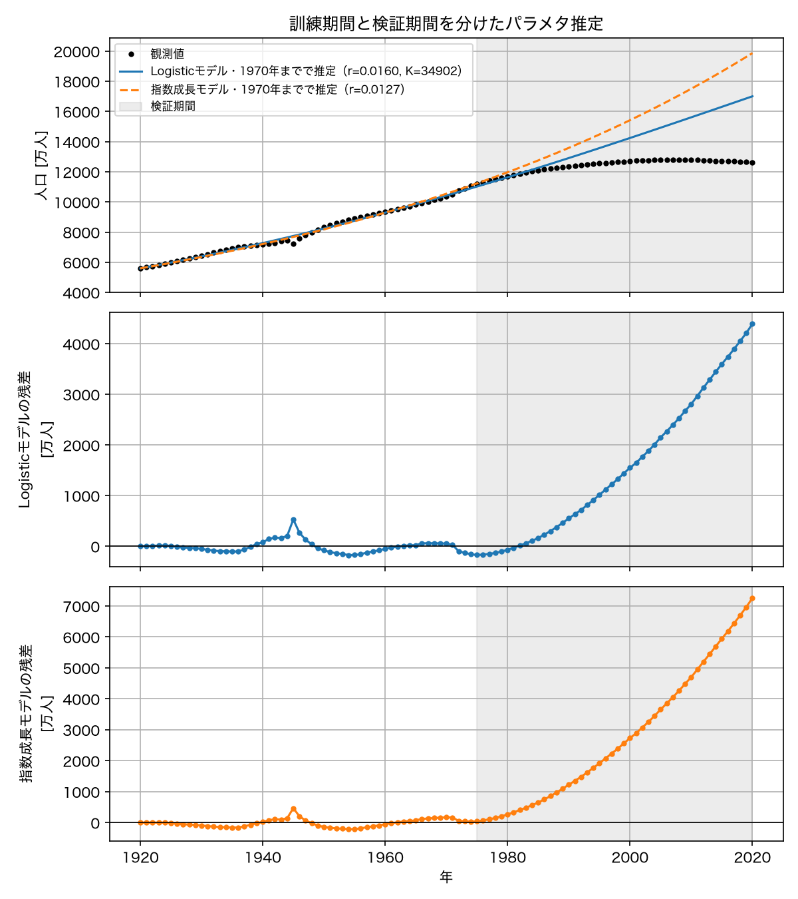
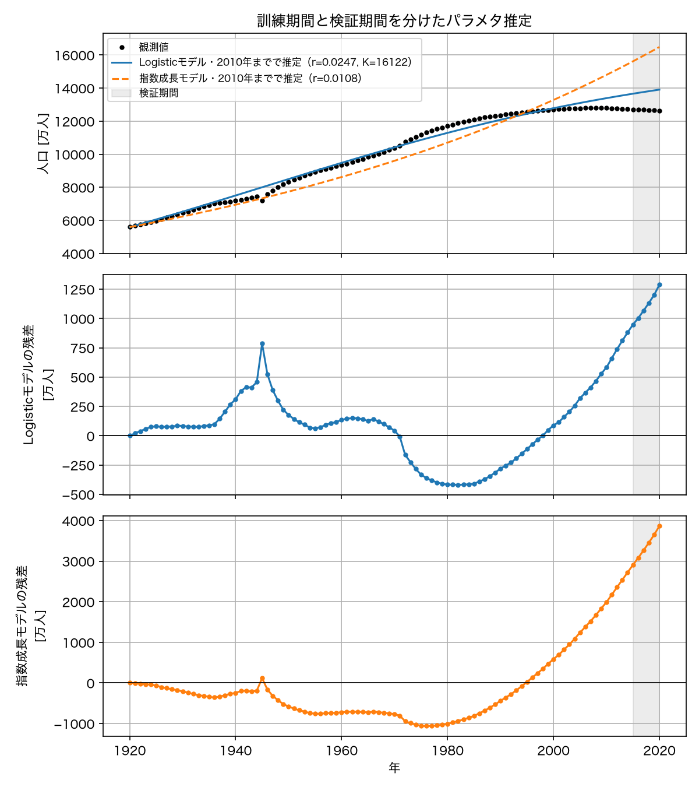
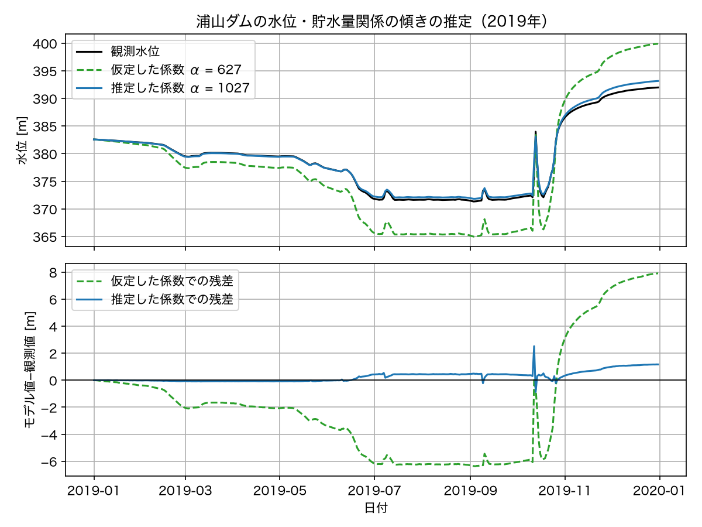
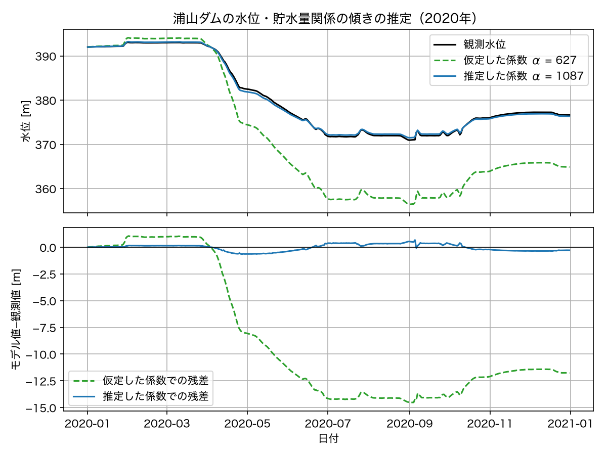
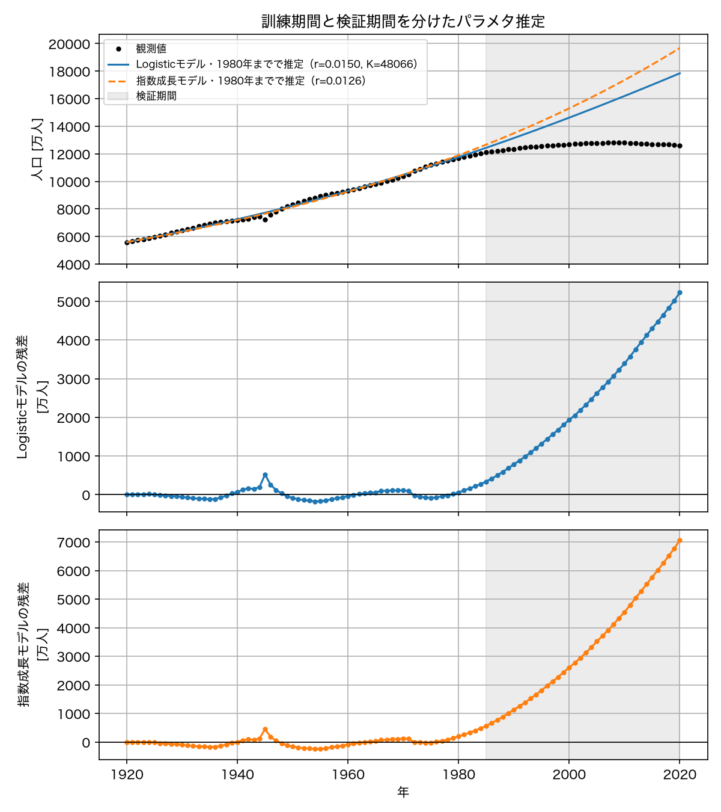
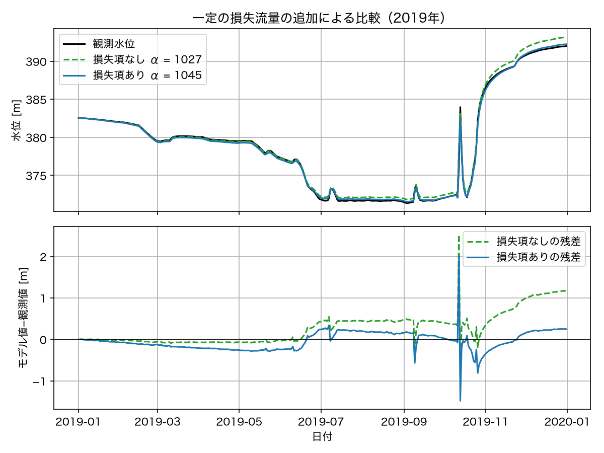

# 第7回　パラメタ推定

### 今回の位置付け

1. 現象の理解
2. 仮定の設定
3. 数理モデルの構築
4. 数値シミュレーション
5. データとの比較
6. <span style="color:red">パラメタ推定</span>
7. モデルの検証と改善

- 第5・6回：格子探索による推定と，観測流量を入力とするダムモデルを扱った．
- **第7回**：**数値最適化**を用いてパラメタを推定する．
  - 推定の実装：残差関数を定義し，`least_squares`でLogisticモデルとダムの換算係数を推定する．
  - 推定結果の検証：初期値による違いと，推定に使わない期間での誤差を確認する．

### 到達目標

- 観測値 $y_i$ とモデル予測 $\hat{y}(t_i;\theta)$ の差から，パラメタ $\theta$ の関数としての目的関数を定義できる
- パラメタサーチ（格子の全探索）と数値最適化（局所的な情報を用いた反復探索）の関係を説明できる
- `scipy.optimize.least_squares`を使って微分方程式モデルのパラメタを推定し，結果の妥当性を確認できる
- 初期値依存性，パラメタの範囲指定，局所解の問題を具体例で説明できる
- データを訓練期間と検証期間に分け，当てはまりの良さと予測の良さが別であることを示せる
- 推定値だけでなく，データ，推定モデル，残差を可視化して報告できる

<!--
**今回の流れ**（105分の目安）

| 段階 | 内容 | 時間 |
| --- | --- | --- |
| 1 | 第5回のヒートマップの復習，格子探索の限界（演習0） | 10分 |
| 2 | 残差と目的関数，最小二乗法，最適化の考え方 | 25分 |
| 3 | `least_squares`によるLogisticモデルの推定，初期値と範囲の指定 | 20分 |
| 4 | 訓練・検証の分割，残差の可視化，ダムデータへの応用（演習1〜4） | 35分 |
| 5 | 推定と検証の区別，まとめ，課題の説明 | 15分 |
-->

## 準備

````{note} 演習0：作業フォルダとNotebookの準備

1. ターミナルで第7回の作業フォルダを作成せよ．

```bash
mkdir -p ~/applied_programming_ii/07
cd ~/applied_programming_ii/07
mkdir -p notebooks reports/figures
```

- **コードの補足**：`mkdir -p`は必要な親フォルダも作成し，`cd`は作業フォルダを移動する．

実行後の構成は次のとおりである．`data`は各回で共通に使用し，`README.md`とNotebookは続く手順で作成する．

```text
applied_programming_ii/
├── data/
└── 07/
    ├── README.md
    ├── notebooks/
    │   └── parameter_estimation.ipynb
    └── reports/
        └── figures/
```

2. `~/applied_programming_ii/data/`に`population_japan.csv`と`dam_urayama_daily.csv`があることを確認せよ．なければ，{download}`人口データ <../data/population_japan.csv>`と{download}`浦山ダムの日データ <../data/dam_urayama_daily.csv>`をダウンロードして保存せよ．

3. `notebooks/parameter_estimation.ipynb`を新規作成せよ．

4. `07`フォルダに`README.md`を作り，次の内容を記入せよ．

```markdown
# 応用プログラミングII 第7回

- 氏名：
- 学籍番号：

## 今日の目標

観測データからモデルのパラメタを最小二乗法で推定し，訓練期間と検証期間の誤差を比べて結果を評価する．

## 推定条件

- モデル：
- 推定するパラメタ：
- 目的関数：
- 訓練期間：
- 検証期間：
- 探索の初期値：
- 微分方程式の初期条件：
- パラメタの範囲：

## 演習1：初期値を変えた結果

1. 最も小さいcostに到達した初期値と，推定値・評価回数：
2. 異なる結果となった初期値とcostの比較：
3. 追加した初期値での推定値・cost・終了理由：

## 演習2

1. 比較した訓練期間とNotebookの図：
2. Kの変化と，推定に使うデータの特徴：
3. 訓練・検証のRMSEが最小の設定と，比較時の注意：

## 演習3

1. 残差が正・負となる時期：
2. 1940年代の変化について考えられる要因と，確認に必要な資料：
3. 残差の傾向から判断できることと，判断できないこと：

## 演習4：ダムの換算の傾き

1. 選んだ年・推定した傾き・RMSE・Notebookの図：
2. 2019年との推定値・水位範囲の比較：

## 課題1

1. 推定条件：
2. 推定値と訓練・検証のRMSE：
3. 探索の初期値による違い：
4. Notebookの図：
5. 残差から見直す仮定と根拠：
6. 訓練期間を5年ずらした場合の推定値の変化：

## 課題2の考察
```

5. Notebookの最初のコードセルで，計算・描画に使うライブラリを読み込み，データの場所と図の保存先を設定せよ．

```python
from pathlib import Path

import numpy as np
import pandas as pd
import matplotlib.pyplot as plt
from scipy.integrate import solve_ivp
from scipy.optimize import least_squares

plt.rcParams["font.family"] = "Hiragino Sans"  # 日本語表示用（macOS）

PROJECT_DIR = Path.home() / "applied_programming_ii" / "07"
DATA_DIR = Path.home() / "applied_programming_ii" / "data"
FIGURE_DIR = PROJECT_DIR / "reports" / "figures"
FIGURE_DIR.mkdir(parents=True, exist_ok=True)

print("作業フォルダ:", PROJECT_DIR)
print("人口データの有無:", (DATA_DIR / "population_japan.csv").exists())
print("ダムデータの有無:", (DATA_DIR / "dam_urayama_daily.csv").exists())
```

```{dropdown} コードの補足

- `least_squares`：残差関数を使ってパラメタを推定するために読み込む．
- `FIGURE_DIR.mkdir(...)`：図の保存先を作成する．
- `.exists()`：人口・ダムの2つのCSVが共通データフォルダにあるかを確認する．
```

出力例（`ユーザー名`の部分は実行環境によって異なる）：

```text
作業フォルダ: /Users/ユーザー名/applied_programming_ii/07
人口データの有無: True
ダムデータの有無: True
```
````

## 復習と今回の準備

以下の数値出力は実行例である．数値解・推定値の末尾や評価回数，終了理由は，ライブラリのバージョンや実行環境によって異なる場合がある．

- **格子探索**：第5回では候補ごとの目的関数を計算した．今回は数値最適化によってパラメタを更新する．
- **観測モデル**：状態変数と観測量を結ぶ関係．第6回では貯水位と貯水量を一定の傾きで換算した．後半ではこの傾きを推定する．
- **比較の条件**：観測値と計算値の時刻・単位をそろえ，残差と誤差指標を計算する．

### 人口データと既習関数の準備

人口データとLogisticモデルを読み込んで準備する．

```python
population = pd.read_csv(DATA_DIR / "population_japan.csv")
population["population_10k"] = population["total_population_thousand"] / 10

# 観測時刻は1920年を0とした年数，観測値は万人
t_obs = (population["year"] - 1920).values.astype(float)
y_obs = population["population_10k"].values
N0 = y_obs[0]

print("観測点の数:", len(t_obs), " 期間:", population["year"].min(), "〜", population["year"].max())
print(f"初期値 N0 = {N0:.1f} 万人")
```

- **コードの補足**：`t_obs`は1920年を0とする経過年数，`y_obs`は万人単位の観測人口である．`N0`は最初の観測人口に固定する．

出力例：

```text
観測点の数: 101  期間: 1920 〜 2020
初期値 N0 = 5596.3 万人
```

第4・5回のLogistic方程式と初期条件を使う．

$$
\frac{dN}{dt}=rN\left(1-\frac{N}{K}\right),\qquad N(0)=N_0.
$$

パラメタの組から観測時刻での人口を求める関数と，平均二乗誤差の関数を定義する．

```python
def logistic_rhs(t, N, r, K):
    """Logisticモデル dN/dt = r N (1 - N/K) の右辺．"""
    return r * N * (1 - N / K)


def simulate_logistic(theta, t_eval, N0):
    """パラメタ theta = (r, K) でLogisticモデルを解き，時刻 t_eval での N を返す．"""
    r, K = theta
    sol = solve_ivp(logistic_rhs, (t_eval[0], t_eval[-1]), [N0], t_eval=t_eval, args=(r, K), rtol=1e-6)
    return sol.y[0]


def mean_squared_error(y_true, y_pred):
    """平均二乗誤差 (1/n) sum (y_true - y_pred)^2 を返す．"""
    return np.mean((y_true - y_pred) ** 2)


# 第5回のヒートマップで谷の底の近くにあった値
theta_grid = (0.028, 14800.0)
mse_grid = mean_squared_error(y_obs, simulate_logistic(theta_grid, t_obs, N0))
print(f"第5回の最良の組に近い (r, K) = {theta_grid}: MSE = {mse_grid:.1f} （RMSE = {np.sqrt(mse_grid):.1f} 万人）")
```

```{dropdown} コードの補足

- `simulate_logistic`：パラメタを受け取り，`solve_ivp`の解を観測時刻の配列に合わせて返す．
- `rtol=1e-6`：数値積分の相対許容誤差を指定する．
- `theta_grid`：第5回の最良の組に近い値で，数値最適化との比較に使う．
```

出力例：

```text
第5回の最良の組に近い (r, K) = (0.028, 14800.0): MSE = 120107.3 （RMSE = 346.6 万人）
```

## 格子探索から数値最適化へ

- **格子探索の計算量**：各パラメタを50通りにすると，2パラメタでは2500回，3パラメタでは125000回，4パラメタでは6250000回のモデル評価が必要になる．1回0.01秒でも，4パラメタでは約17時間かかる．
- **数値最適化の考え方**：現在のパラメタを少し変えたときの残差の変化を利用し，次の候補を決める．全ての格子点を調べる必要がなく，少ない評価回数で推定できる場合がある．
- **結果の確認**：反復計算は停止条件を満たしたところで終了する．得られた候補が全範囲で最良とは限らないため，複数の開始点や第5回の目的関数の分布と照合する．

## 残差と目的関数

### 残差

観測時刻 $t_i$ における観測値を $y_i$ ，パラメタ $\theta$ のモデルが与える予測を $\hat{y}(t_i;\theta)$ とする．
その差

$$
e_i(\theta) = \hat{y}(t_i;\theta) - y_i
\qquad (i = 1, \ldots, n)
$$

を残差として使う．

- **残差**：ここでは計算値から観測値を引いた差．正なら過大評価，負なら過小評価を表す．
- **残差ベクトル**：各観測時刻の残差を並べた配列．パラメタを変えると，その組で計算した人口に応じて値が変わる．

第3〜5回の図とは残差の符号を逆にしているが，二乗和とそれを最小にするパラメタは変わらない．

### 目的関数と最小二乗法

残差をまとめて1つの数にしたものが目的関数である．
最もよく使われるのは残差の二乗和で，

$$
J(\theta) = \sum_{i=1}^{n} e_i(\theta)^2 = \sum_{i=1}^{n} \left( \hat{y}(t_i;\theta) - y_i \right)^2
$$

である．

- **最小二乗法**：残差の二乗和を最小にするパラメタを選ぶ方法．

第5回で使った平均二乗誤差 MSE は $J(\theta)/n$ であり， $n$ は定数なので，MSE を最小にする $\theta$ と $J$ を最小にする $\theta$ は同じである．

- **二乗の役割**：正負の残差の打ち消しを防ぎ，大きな残差を重く評価する．
- **解釈上の注意**：少数の大きな残差が推定値を強く左右する場合がある．推定後は，誤差指標に加えて残差の時系列を確認する．

### 推定対象の選択

$J(\theta)$ は， $\theta$ を入力，誤差を出力とする関数である．
第5回のヒートマップは，この関数を $(r, K)$ 平面の上に描いたものにほかならない．
今回はこの関数の最小値を，`scipy.optimize.least_squares`に探させる．

```{tip} 目的関数の設計はモデル化の一部である
残差の二乗和は標準的だが，唯一の選択ではない．
人口のように値の桁が変わるデータでは，相対誤差 $(\hat{y}_i - y_i)/y_i$ を使う方が適切なこともある．
観測の信頼度が時期によって違うなら，重みを付けることもできる．
どの目的関数を使うかは，データの性質と目的から決める判断であり，結果に影響する．
```

## `least_squares`によるパラメタ推定

### 残差関数の定義

`least_squares`は，残差のベクトルを返す関数を受け取り，その二乗和を最小にするパラメタを探す．
目的関数を自分で計算する必要はなく，残差の配列を返せばよい．
関数の第1引数は推定するパラメタの配列，それ以降は`args`で渡す固定の情報である．

```python
def residuals(theta, t_obs, y_obs, N0):
    """パラメタ theta = (r, K) におけるLogisticモデルの残差ベクトル（モデル - 観測）を返す．"""
    return simulate_logistic(theta, t_obs, N0) - y_obs


residual_grid = residuals(theta_grid, t_obs, y_obs, N0)
print("残差の配列の形:", residual_grid.shape)
print(f"最初の観測時刻の残差: {residual_grid[0]:.1f} 万人")
```

- **コードの補足**：残差関数はMSEではなく，観測点ごとの差を配列で返す．初日のモデル値を観測人口に合わせているため，最初の残差は0となる．

出力例：

```text
残差の配列の形: (101,)
最初の観測時刻の残差: 0.0 万人
```

### 推定の実行

第5回の格子探索を参考に，パラメタ探索の出発点を与えて推定する．微分方程式の初期条件 $N_0$ は最初の観測人口に固定している．

```python
theta_initial = [0.03, 13000.0]

result = least_squares(residuals, theta_initial, args=(t_obs, y_obs, N0))

r_hat, K_hat = result.x
print("収束したか:", result.success, " 状態:", result.message)
print(f"推定値: r = {r_hat:.5f} /年,  K = {K_hat:.1f} 万人")
print(f"目的関数（残差二乗和の半分）: {result.cost:.1f}")
print(f"RMSE: {np.sqrt(np.mean(result.fun ** 2)):.1f} 万人")
print(f"残差関数の評価回数: {result.nfev}")
```

```{dropdown} コードの補足

- `least_squares`：残差関数と探索の初期値を渡す．`args`には観測データと微分方程式の初期条件を指定する．
- `result.x`・`result.fun`：推定されたパラメタと，その推定値での残差配列である．
- `result.cost`：残差二乗和の半分，すなわち $J/2$ である．`result.nfev`は評価回数（探索中に残差関数を呼び出した回数）を表す．既定の手法では，数値微分用の追加評価はこの回数に含まれない．
- `result.success`・`result.message`：停止条件を満たしたかと終了理由を示す．出力の`ftol`は，目的関数の減少量に関する停止条件を表す．
```

出力例：

```text
収束したか: True  状態: `ftol` termination condition is satisfied.
推定値: r = 0.02759 /年,  K = 14753.8 万人
目的関数（残差二乗和の半分）: 5807180.6
RMSE: 339.1 万人
残差関数の評価回数: 7
```

この例では少ない探索評価で停止条件を満たしている．ただし，`nfev`は全てのモデル評価を数えた値ではないため，格子探索の候補数との比をそのまま速度向上率とはみなさない．引数と戻り値の詳細は[SciPyの公式説明](https://docs.scipy.org/doc/scipy/reference/generated/scipy.optimize.least_squares.html)で確認できる．

### 初期値依存性

数値最適化の結果は探索の初期値に依存し，異なる極小点や停止点に到達することがある．ここでの初期値はパラメタ探索の開始値であり，微分方程式の初期条件とは区別する．
複数の初期値から推定し，到達したパラメタ・目的関数値・評価回数を比較する．

```python
initial_guesses = [
    [0.03, 13000.0],
    [0.01, 20000.0],
    [0.10, 10000.0],
    [0.05, 30000.0],
]

print(f"{'初期値 (r, K)':>22} {'推定 r':>10} {'推定 K':>10} {'cost':>12} {'評価回数':>8}")
for guess in initial_guesses:
    res = least_squares(residuals, guess, args=(t_obs, y_obs, N0))
    print(f"{str(guess):>22} {res.x[0]:10.5f} {res.x[1]:10.1f} {res.cost:12.1f} {res.nfev:8d}")
```

- **コードの補足**：`for guess in initial_guesses`：探索の初期値を1組ずつ渡して推定を繰り返す．`cost`と評価回数も並べ，到達した点と計算量の違いを確認する．

出力例：

```text
            初期値 (r, K)       推定 r       推定 K         cost     評価回数
       [0.03, 13000.0]    0.02759    14753.8    5807180.6        7
       [0.01, 20000.0]    0.02759    14753.8    5807180.6       10
        [0.1, 10000.0]    0.06375    10000.0  157753795.5       22
       [0.05, 30000.0]    0.02759    14753.8    5807180.6        6
```

````{note} 演習1：初期値を変えて推定する

1. 4つの結果から，最も小さいcostに到達した初期値と，対応する推定値・評価回数を記せ．表示桁数で一致する結果は同程度とみなせ．
2. 異なる推定値に到達した初期値を挙げ，costが最小の結果の何倍か求めよ．
3. 「推定の実行」の初期値を`[0.5, 6000.0]`に変更し，推定値・cost・終了理由を他の結果と比較せよ．
````

````{visible-answer} 演習1の解答例

**1．同程度のcostに到達した初期値**

初期値 `[0.03, 13000.0]`，`[0.01, 20000.0]`，`[0.05, 30000.0]` では，表示桁数の範囲で同じ $r=0.02759$ ， $K=14753.8$ 万人，cost $=5807180.6$ を得る．評価回数は順に7，10，6回である．

**2．異なる推定値に到達した初期値**

`[0.10, 10000.0]` では， $r=0.06375$ ， $K=10000.0$ 万人付近で終了し，costは157753795.5となる．最小の結果との比は $157753795.5/5807180.6\approx27.2$ である．同じデータでも，探索の開始点によって異なる結果を得ている．

**3．追加した初期値での推定**

本文の初期値を変更し，推定値と終了理由を確認する．

```{code-block} python
:linenos:
:emphasize-lines: 1
:class: code-focus

theta_initial = [0.5, 6000.0]

result = least_squares(residuals, theta_initial, args=(t_obs, y_obs, N0))

r_hat, K_hat = result.x
print("収束したか:", result.success, " 状態:", result.message)
print(f"推定値: r = {r_hat:.5f} /年,  K = {K_hat:.1f} 万人")
print(f"目的関数（残差二乗和の半分）: {result.cost:.1f}")
print(f"RMSE: {np.sqrt(np.mean(result.fun ** 2)):.1f} 万人")
print(f"残差関数の評価回数: {result.nfev}")
```

- **コードの補足**：`theta_initial`だけを変え，同じ残差関数と全期間のデータを使う．

出力例：

```text
収束したか: False  状態: The maximum number of function evaluations is exceeded.
推定値: r = 0.41007 /年,  K = 6304.3 万人
目的関数（残差二乗和の半分）: 1011378002.6
RMSE: 4475.2 万人
残差関数の評価回数: 200
```

この例では**評価回数の上限に達して終了**し，costも他の初期値の結果より大きい．停止結果と目的関数値を併せて確認する必要がある．この出力だけから，原因が局所的な極小点なのか，パラメタの尺度や数値微分の影響なのかを特定することはできない．
````


### パラメタの範囲指定

パラメタには，モデルの意味から決まる範囲がある．
ここでは増加または一定の人口を表すため， $r\geq0$ ， $K>N_0$ に制限する．計算では $K$ の下限を初期人口5596.3万人より大きい6000万人とする．
`bounds`で範囲を指定すると，設定した仮定と整合しない範囲での探索を防げる．

同じ探索初期値 `[0.5, 6000.0]` に範囲指定を加え，推定値とcostを比較する．

```python
lower_bounds = [0.0, 6000.0]       # r >= 0, K >= 6000 万人
upper_bounds = [1.0, 50000.0]      # r <= 1, K <= 50000 万人

result_bounded = least_squares(residuals, [0.5, 6000.0], args=(t_obs, y_obs, N0), bounds=(lower_bounds, upper_bounds))
print(f"範囲を指定した場合: r = {result_bounded.x[0]:.5f}, K = {result_bounded.x[1]:.1f}, cost = {result_bounded.cost:.1f}")
```

- **コードの補足**：`bounds=(lower_bounds, upper_bounds)`：各パラメタの下限と上限を同じ順番で指定する．ここでは $r$ を0〜1， $K$ を6000〜50000万人に制限する．

出力例：

```text
範囲を指定した場合: r = 0.02759, K = 14753.8, cost = 5807180.6
```

範囲を指定しても，局所解の問題が完全に消えるわけではない．
複数の初期値を試すこと，第5回のような粗い格子探索で全体の地形を見ておくことが，最適化の前の準備として有効である．

## 訓練期間と検証期間

### 訓練期間と検証期間の役割

ここまでは1920年から2020年の全データを使って推定した．
推定では訓練データの残差を小さくするようパラメタを選ぶ．したがって，訓練誤差だけでは未使用データに対する予測精度を評価できない．

未使用期間の予測精度を確かめるため，データを次の2つに分ける．

- **訓練期間**：パラメタの推定に使う期間
- **検証期間**：推定したモデルの予測を観測と比べる期間

時系列データでは，過去を訓練，未来を検証にするのが自然である．
ここでは1990年までを訓練，1995年から2020年を検証とする．訓練期間の最終年を変えると，検証開始年も5年後へ変わるように指定する．

```python
train_end = 1990
valid_start = train_end + 5
train_mask = population["year"] <= train_end
valid_mask = population["year"] >= valid_start

t_train, y_train = t_obs[train_mask], y_obs[train_mask]
t_valid, y_valid = t_obs[valid_mask], y_obs[valid_mask]
print(f"訓練期間: {len(t_train)} 点（1920〜{train_end}年）， 検証期間: {len(t_valid)} 点（{valid_start}〜2020年）")

result_train = least_squares(residuals, [0.03, 13000.0], args=(t_train, y_train, N0), bounds=(lower_bounds, upper_bounds))
r_train, K_train = result_train.x
print(f"訓練期間で推定: r = {r_train:.5f} /年,  K = {K_train:.1f} 万人")

# 推定したパラメタで全期間を計算する
y_fit_all = simulate_logistic(result_train.x, t_obs, N0)
rmse_train = np.sqrt(mean_squared_error(y_train, y_fit_all[train_mask]))
rmse_valid = np.sqrt(mean_squared_error(y_valid, y_fit_all[valid_mask]))
print(f"訓練期間の RMSE: {rmse_train:8.1f} 万人")
print(f"検証期間の RMSE: {rmse_valid:8.1f} 万人")
print(f"2020年の予測: {y_fit_all[-1]:.1f} 万人，観測: {y_obs[-1]:.1f} 万人")
```

```{dropdown} コードの補足

- `train_mask`・`valid_mask`：推定用と検証用のデータを選ぶ条件である．ここでは1991〜1994年はどちらの誤差評価にも含めない．
- `result_train`：訓練期間の観測値だけを用いてパラメタを推定する．
- `y_fit_all`：1920年の初期条件から全期間を計算し，訓練期間と検証期間に対応する値を取り出してRMSEを求める．
```

出力例：

```text
訓練期間: 71 点（1920〜1990年）， 検証期間: 26 点（1995〜2020年）
訓練期間で推定: r = 0.01787 /年,  K = 25872.2 万人
訓練期間の RMSE:    141.0 万人
検証期間の RMSE:   2154.6 万人
2020年の予測: 16101.1 万人，観測: 12614.6 万人
```

- **推定値の変化**：1990年までで推定した $K$ は約25900万人で，全期間で推定した約14750万人より大きい．人口の増加が鈍る後半のデータを含めるかどうかで，推定値が変わる．
- **未使用期間の誤差**：訓練RMSEは約140万人，検証RMSEは約2150万人である．訓練期間に近い曲線を得ても，その後の人口を同じ精度で予測できるとは限らない．

### 指数成長モデルとの比較

第4回で比べた指数成長モデル $N' = rN$ も，同じ訓練期間で推定して検証期間の誤差を比べる．

```python
def residuals_exponential(theta, t_obs, y_obs, N0):
    """指数成長モデル N0 exp(r t) の残差ベクトルを返す．"""
    return N0 * np.exp(theta[0] * t_obs) - y_obs


result_exp = least_squares(residuals_exponential, [0.01], args=(t_train, y_train, N0))
y_exp_all = N0 * np.exp(result_exp.x[0] * t_obs)
print(f"指数成長モデル: r = {result_exp.x[0]:.5f} /年")
print(f"  訓練期間の RMSE: {np.sqrt(mean_squared_error(y_train, y_exp_all[train_mask])):8.1f} 万人")
print(f"  検証期間の RMSE: {np.sqrt(mean_squared_error(y_valid, y_exp_all[valid_mask])):8.1f} 万人")
```

- **コードの補足**：`theta[0]`：推定する唯一のパラメタ $r$ を取り出す．指数成長モデルは解析解で計算し，Logisticモデルと同じ訓練期間・初期人口で比較する．

出力例：

```text
指数成長モデル: r = 0.01219 /年
  訓練期間の RMSE:    233.1 万人
  検証期間の RMSE:   3896.7 万人
```

### 観測値・モデル・残差の可視化

推定結果を報告するときは，推定値の数字だけでなく，データと推定モデルを重ねた図と，残差の時系列を示す．
残差に時間的な偏りがあれば，モデルの構造，パラメタの設定，観測過程のいずれに原因があるかを検討する．

```python
years = population["year"].values
residual_all = y_fit_all - y_obs
print(f"Logisticモデルの残差の範囲: {residual_all.min():.1f} 〜 {residual_all.max():.1f} 万人")
```

- **コードの補足**：`residual_all`はモデル値−観測値である．正なら過大予測，負なら過小予測を表す．

出力例：

```text
Logisticモデルの残差の範囲: -215.3 〜 3486.5 万人
```

人口の観測値と2つのモデルを上段，それぞれの残差を中段・下段に示す．

```python
fig, axes = plt.subplots(3, 1, figsize=(8, 9), sharex=True)

axes[0].plot(years, y_obs, color="black", marker="o", markersize=3, linestyle="none", label="観測値")
axes[0].plot(years, y_fit_all, color="tab:blue", label=f"Logisticモデル・{train_end}年までで推定（r={r_train:.4f}, K={K_train:.0f}）")
axes[0].plot(years, y_exp_all, color="tab:orange", linestyle="--", label=f"指数成長モデル・{train_end}年までで推定（r={result_exp.x[0]:.4f}）")
axes[0].axvspan(valid_start, 2020, color="gray", alpha=0.15, label="検証期間")
axes[0].set_ylabel("人口 [万人]")
axes[0].set_ylim(4000, 1.05 * max(y_obs.max(), y_fit_all.max(), y_exp_all.max()))
axes[0].set_title("訓練期間と検証期間を分けたパラメタ推定")
axes[0].legend(fontsize=8)

axes[1].plot(years, residual_all, color="tab:blue", marker="o", markersize=3)
axes[1].axhline(0, color="black", linewidth=0.8)
axes[1].axvspan(valid_start, 2020, color="gray", alpha=0.15)
axes[1].set_ylabel("Logisticモデルの残差\n[万人]")

axes[2].plot(years, y_exp_all - y_obs, color="tab:orange", marker="o", markersize=3)
axes[2].axhline(0, color="black", linewidth=0.8)
axes[2].axvspan(valid_start, 2020, color="gray", alpha=0.15)
axes[2].set_ylabel("指数成長モデルの残差\n[万人]")
axes[2].set_xlabel("年")

for ax in axes:
    ax.grid(True)
fig.tight_layout()
fig.savefig(FIGURE_DIR / f"population_fit_{train_end}.png", dpi=150)
plt.show()
```

```{dropdown} コードの補足

- `sharex=True`：人口と2種類の残差の横軸を共有する．
- `axvspan(valid_start, 2020, ...)`：検証期間を背景色で示す．`alpha`は背景色の不透明度である．
- `set_ylim`：観測値と両モデルの最大値に合わせ，予測曲線全体が収まる縦軸の範囲を設定する．
```



````{note} 演習2：訓練期間の長さを変える

1. 訓練期間の終わりを1970年，1990年，2010年の3通りとし，Logisticモデルの推定値と訓練・検証のRMSEを出力せよ．各条件で「指数成長モデルとの比較」以降も再実行し，人口と残差の図をNotebookに示せ．
2. 訓練期間を長くしたときの $K$ の変化を記し，人口増加の鈍化を示すデータとの関係を説明せよ．
3. 訓練RMSEが最小の設定と検証RMSEが最小の設定を答えよ．ただし，設定ごとに検証対象の年と期間の長さが変わることも記せ．
````

````{visible-answer} 演習2の解答例

**1．訓練期間を変更した推定と図**

1990年までの結果は本文の図と出力を使う．以下では1970年，2010年の順に，訓練期間の最終年だけを変えて再計算する．

訓練期間を1970年までに変更し，Logisticモデルを推定する．

```{code-block} python
:linenos:
:emphasize-lines: 1
:class: code-focus

train_end = 1970
valid_start = train_end + 5
train_mask = population["year"] <= train_end
valid_mask = population["year"] >= valid_start

t_train, y_train = t_obs[train_mask], y_obs[train_mask]
t_valid, y_valid = t_obs[valid_mask], y_obs[valid_mask]
print(f"訓練期間: {len(t_train)} 点（1920〜{train_end}年）， 検証期間: {len(t_valid)} 点（{valid_start}〜2020年）")

result_train = least_squares(residuals, [0.03, 13000.0], args=(t_train, y_train, N0), bounds=(lower_bounds, upper_bounds))
r_train, K_train = result_train.x
print(f"訓練期間で推定: r = {r_train:.5f} /年,  K = {K_train:.1f} 万人")

# 推定したパラメタで全期間を計算する
y_fit_all = simulate_logistic(result_train.x, t_obs, N0)
rmse_train = np.sqrt(mean_squared_error(y_train, y_fit_all[train_mask]))
rmse_valid = np.sqrt(mean_squared_error(y_valid, y_fit_all[valid_mask]))
print(f"訓練期間の RMSE: {rmse_train:8.1f} 万人")
print(f"検証期間の RMSE: {rmse_valid:8.1f} 万人")
print(f"2020年の予測: {y_fit_all[-1]:.1f} 万人，観測: {y_obs[-1]:.1f} 万人")
```

- **コードの補足**：`train_end`を変えると，訓練・検証の抽出条件も変わる．

出力例：

```text
訓練期間: 51 点（1920〜1970年）， 検証期間: 46 点（1975〜2020年）
訓練期間で推定: r = 0.01605 /年,  K = 34902.2 万人
訓練期間の RMSE:    122.1 万人
検証期間の RMSE:   2089.0 万人
2020年の予測: 17007.9 万人，観測: 12614.6 万人
```

指数成長モデルも同じ期間で推定し，Logisticモデルの残差を用意する．

```python
result_exp = least_squares(residuals_exponential, [0.01], args=(t_train, y_train, N0))
y_exp_all = N0 * np.exp(result_exp.x[0] * t_obs)
print(f"指数成長モデル: r = {result_exp.x[0]:.5f} /年")
print(f"  訓練期間の RMSE: {np.sqrt(mean_squared_error(y_train, y_exp_all[train_mask])):8.1f} 万人")
print(f"  検証期間の RMSE: {np.sqrt(mean_squared_error(y_valid, y_exp_all[valid_mask])):8.1f} 万人")


years = population["year"].values
residual_all = y_fit_all - y_obs
print(f"Logisticモデルの残差の範囲: {residual_all.min():.1f} 〜 {residual_all.max():.1f} 万人")
```

- **コードの補足**：`t_train`と`y_train`が更新されているため，推定・残差の計算手順は本文のままでよい．

出力例：

```text
指数成長モデル: r = 0.01267 /年
  訓練期間の RMSE:    132.6 万人
  検証期間の RMSE:   3516.4 万人
Logisticモデルの残差の範囲: -172.8 〜 4393.3 万人
```

人口と両モデルの残差を描き，検証期間の予測を確認する．

```python
fig, axes = plt.subplots(3, 1, figsize=(8, 9), sharex=True)

axes[0].plot(years, y_obs, color="black", marker="o", markersize=3, linestyle="none", label="観測値")
axes[0].plot(years, y_fit_all, color="tab:blue", label=f"Logisticモデル・{train_end}年までで推定（r={r_train:.4f}, K={K_train:.0f}）")
axes[0].plot(years, y_exp_all, color="tab:orange", linestyle="--", label=f"指数成長モデル・{train_end}年までで推定（r={result_exp.x[0]:.4f}）")
axes[0].axvspan(valid_start, 2020, color="gray", alpha=0.15, label="検証期間")
axes[0].set_ylabel("人口 [万人]")
axes[0].set_ylim(4000, 1.05 * max(y_obs.max(), y_fit_all.max(), y_exp_all.max()))
axes[0].set_title("訓練期間と検証期間を分けたパラメタ推定")
axes[0].legend(fontsize=8)

axes[1].plot(years, residual_all, color="tab:blue", marker="o", markersize=3)
axes[1].axhline(0, color="black", linewidth=0.8)
axes[1].axvspan(valid_start, 2020, color="gray", alpha=0.15)
axes[1].set_ylabel("Logisticモデルの残差\n[万人]")

axes[2].plot(years, y_exp_all - y_obs, color="tab:orange", marker="o", markersize=3)
axes[2].axhline(0, color="black", linewidth=0.8)
axes[2].axvspan(valid_start, 2020, color="gray", alpha=0.15)
axes[2].set_ylabel("指数成長モデルの残差\n[万人]")
axes[2].set_xlabel("年")

for ax in axes:
    ax.grid(True)
fig.tight_layout()
fig.savefig(FIGURE_DIR / f"population_fit_{train_end}.png", dpi=150)
plt.show()
```

- **コードの補足**：凡例と検証期間の背景は，指定した年に合わせて変わる．



訓練期間を2010年までに変更し，Logisticモデルを推定する．

```{code-block} python
:linenos:
:emphasize-lines: 1
:class: code-focus

train_end = 2010
valid_start = train_end + 5
train_mask = population["year"] <= train_end
valid_mask = population["year"] >= valid_start

t_train, y_train = t_obs[train_mask], y_obs[train_mask]
t_valid, y_valid = t_obs[valid_mask], y_obs[valid_mask]
print(f"訓練期間: {len(t_train)} 点（1920〜{train_end}年）， 検証期間: {len(t_valid)} 点（{valid_start}〜2020年）")

result_train = least_squares(residuals, [0.03, 13000.0], args=(t_train, y_train, N0), bounds=(lower_bounds, upper_bounds))
r_train, K_train = result_train.x
print(f"訓練期間で推定: r = {r_train:.5f} /年,  K = {K_train:.1f} 万人")

# 推定したパラメタで全期間を計算する
y_fit_all = simulate_logistic(result_train.x, t_obs, N0)
rmse_train = np.sqrt(mean_squared_error(y_train, y_fit_all[train_mask]))
rmse_valid = np.sqrt(mean_squared_error(y_valid, y_fit_all[valid_mask]))
print(f"訓練期間の RMSE: {rmse_train:8.1f} 万人")
print(f"検証期間の RMSE: {rmse_valid:8.1f} 万人")
print(f"2020年の予測: {y_fit_all[-1]:.1f} 万人，観測: {y_obs[-1]:.1f} 万人")
```

- **コードの補足**：`train_end`を変えると，訓練・検証の抽出条件も変わる．

出力例：

```text
訓練期間: 91 点（1920〜2010年）， 検証期間: 6 点（2015〜2020年）
訓練期間で推定: r = 0.02467 /年,  K = 16122.3 万人
訓練期間の RMSE:    269.0 万人
検証期間の RMSE:   1112.2 万人
2020年の予測: 13903.2 万人，観測: 12614.6 万人
```

指数成長モデルも同じ期間で推定し，Logisticモデルの残差を用意する．

```python
result_exp = least_squares(residuals_exponential, [0.01], args=(t_train, y_train, N0))
y_exp_all = N0 * np.exp(result_exp.x[0] * t_obs)
print(f"指数成長モデル: r = {result_exp.x[0]:.5f} /年")
print(f"  訓練期間の RMSE: {np.sqrt(mean_squared_error(y_train, y_exp_all[train_mask])):8.1f} 万人")
print(f"  検証期間の RMSE: {np.sqrt(mean_squared_error(y_valid, y_exp_all[valid_mask])):8.1f} 万人")


years = population["year"].values
residual_all = y_fit_all - y_obs
print(f"Logisticモデルの残差の範囲: {residual_all.min():.1f} 〜 {residual_all.max():.1f} 万人")
```

- **コードの補足**：`t_train`と`y_train`が更新されているため，推定・残差の計算手順は本文のままでよい．

出力例：

```text
指数成長モデル: r = 0.01080 /年
  訓練期間の RMSE:    732.2 万人
  検証期間の RMSE:   3384.8 万人
Logisticモデルの残差の範囲: -418.5 〜 1288.6 万人
```

人口と両モデルの残差を描き，検証期間の予測を確認する．

```python
fig, axes = plt.subplots(3, 1, figsize=(8, 9), sharex=True)

axes[0].plot(years, y_obs, color="black", marker="o", markersize=3, linestyle="none", label="観測値")
axes[0].plot(years, y_fit_all, color="tab:blue", label=f"Logisticモデル・{train_end}年までで推定（r={r_train:.4f}, K={K_train:.0f}）")
axes[0].plot(years, y_exp_all, color="tab:orange", linestyle="--", label=f"指数成長モデル・{train_end}年までで推定（r={result_exp.x[0]:.4f}）")
axes[0].axvspan(valid_start, 2020, color="gray", alpha=0.15, label="検証期間")
axes[0].set_ylabel("人口 [万人]")
axes[0].set_ylim(4000, 1.05 * max(y_obs.max(), y_fit_all.max(), y_exp_all.max()))
axes[0].set_title("訓練期間と検証期間を分けたパラメタ推定")
axes[0].legend(fontsize=8)

axes[1].plot(years, residual_all, color="tab:blue", marker="o", markersize=3)
axes[1].axhline(0, color="black", linewidth=0.8)
axes[1].axvspan(valid_start, 2020, color="gray", alpha=0.15)
axes[1].set_ylabel("Logisticモデルの残差\n[万人]")

axes[2].plot(years, y_exp_all - y_obs, color="tab:orange", marker="o", markersize=3)
axes[2].axhline(0, color="black", linewidth=0.8)
axes[2].axvspan(valid_start, 2020, color="gray", alpha=0.15)
axes[2].set_ylabel("指数成長モデルの残差\n[万人]")
axes[2].set_xlabel("年")

for ax in axes:
    ax.grid(True)
fig.tight_layout()
fig.savefig(FIGURE_DIR / f"population_fit_{train_end}.png", dpi=150)
plt.show()
```

- **コードの補足**：凡例と検証期間の背景は，指定した年に合わせて変わる．



**2．Kの変化**

訓練終了年が1970，1990，2010年の順に， $K$ は約34902，25872，16122万人と小さくなる．後半の人口増加が鈍るデータを含めることで，早い時期の増加だけから推定した大きな $K$ では当てはまりにくくなる．推定された $K$ は，採用した期間に対して定数パラメタで当てはめた結果である．

**3．RMSEの比較**

- **訓練RMSEが最小の設定**：1970年までの約122万人．1990年までは約141万人，2010年までは約269万人となる．
- **検証RMSEが最小の設定**：2010年までで推定した場合の約1112万人．1970年までは約2089万人，1990年までは約2155万人となる．訓練RMSEが最小の設定とは一致しない．
- **比較時の注意**：検証期間は1975〜2020年，1995〜2020年，2015〜2020年と異なる．この結果だけから，訓練期間を長くすれば同じ将来期間で必ず精度が上がるとは結論できない．
````

````{note} 演習3：残差の形を読む

訓練期間を1990年までに戻した「観測値・モデル・残差の可視化」の図を使い，次を`README.md`に記せ．

1. 訓練期間のLogisticモデルの残差が正・負となる時期を，それぞれ挙げよ．
2. 1940年代の人口の急な変化について，モデルに含まれていない要因を1つ挙げ，確認に必要な資料も記せ．図だけから原因を断定しないこと．
3. 残差に時間的な偏りがある場合に見直す点を述べよ．偏りが目立たない場合でも，モデルが正しいと断定できるか答えよ．
````

````{visible-answer} 演習3の解答例

**1．残差の符号**

1990年までで推定した本文の図では，例えば1925年・1945年・1970年・1990年は正，1935年・1950年・1980年は負である．特に1945年は約583万人の過大評価，1980年は約157万人の過小評価となる．時期によって同じ符号が続く傾向が見られる．

**2．急な変化に関係しうる要因**

戦争に伴う死亡や人口移動を候補として挙げる．定数 $r,K$ のLogisticモデルでは，これらによる急な変化を個別に表していない．確認には，当時の出生・死亡・人口移動の統計と，人口データの集計範囲・推計方法の説明が必要になる．残差の図だけで，各要因の寄与は決められない．

**3．残差の傾向とモデルの評価**

- **偏りがある場合**：定数の係数で表す仮定，モデルに含めていない要因，観測・集計方法の変化を見直す．
- **偏りが目立たない場合**：その図では明確な時間的傾向が見つからなかったと言える．モデルが正しいことや，将来の予測精度まで保証するものではないため，未使用期間の誤差も確認する．
````

```{tip} 推定と検証は別の作業である
パラメタ推定では，モデルと目的関数を固定し，訓練データに対する目的関数を小さくするパラメタを求める．
検証では，推定に使用しなかったデータに対する予測誤差や残差の傾向を評価する．
前者がうまくいっても後者がうまくいくとは限らない．
第12回では，この区別を土台にして，複数のモデルを比較する方法を扱う．
```

## オープンデータへの応用：ダムの貯水位と貯水量の換算

### 貯水位・貯水量の換算係数の推定

第6回では，貯水位 $h$ から貯水量 $V$ への換算を傾き約627千m³/mの線形関係とした．
これはダムの諸元から仮定した値で，計算結果は観測から最終的に約5,000千m³ずれた．
この傾きを未知のパラメタ $\alpha$ とし，データから推定する．

$$
V(t) = \alpha\,(h(t) - h_{\min}),
\qquad
\frac{dV}{dt} = Q_{\mathrm{in}}(t) - Q_{\mathrm{out}}(t)
$$

$V$ は直接観測されないので，残差は観測量である貯水位で定義する．
モデルの貯水量を $\alpha$ で割って貯水位に戻し，時刻 $t_i$ の観測水位 $h_i$ との差を残差とする．

$$
\hat{h}(t_i;\alpha) = h_{\min} + \frac{V(t_i)}{\alpha},
\qquad
e_i(\alpha) = \hat{h}(t_i;\alpha) - h_i
$$

初期貯水量も $V_0=\alpha(h_0-h_{\min})$ とし，候補の $\alpha$ ごとに設定し直す．第6回と同じく，流入量は貯水位の変化と放流量から逆算された値である．この当てはめは，独立な観測による容量曲線の検証とは区別する．

2019年の水位と流量を取り出し，第6回と同じ単位にそろえる．

```python
dam = pd.read_csv(DATA_DIR / "dam_urayama_daily.csv", parse_dates=["date"])
year = 2019
dam_year = dam[dam["date"].dt.year == year].reset_index(drop=True)

SECONDS_PER_DAY = 24 * 60 * 60
LEVEL_MIN = 304.0


def m3s_to_1000m3_per_day(flow_m3s):
    """流量 [m^3/s] を [千m^3/日] に換算する．"""
    return flow_m3s * SECONDS_PER_DAY / 1000


t_dam = np.arange(len(dam_year), dtype=float)
qin_dam = m3s_to_1000m3_per_day(dam_year["inflow_m3s"].values)
qout_dam = m3s_to_1000m3_per_day(dam_year["outflow_m3s"].values)
h_dam = dam_year["water_level_m"].values
print(f"対象年: {year}年，水位の範囲: {h_dam.min():.2f} 〜 {h_dam.max():.2f} m")
```

- **コードの補足**：流量は千m³/日，水位はmで扱う．時刻配列は，第6回と同じく初日を0とした経過日数である．

出力例：

```text
対象年: 2019年，水位の範囲: 371.35 〜 391.99 m
```

候補の換算係数ごとに初期貯水量を設定し，収支モデルで得た貯水量を水位へ戻す．その水位と観測水位の差を残差関数で返す．

```python
def reservoir_rhs(t, V, t_data, qin_data, qout_data):
    """dV/dt = Q_in(t) - Q_out(t) の右辺．入力は観測値の線形補間．"""
    return np.interp(t, t_data, qin_data) - np.interp(t, t_data, qout_data)


def simulate_level(alpha, t_data, qin_data, qout_data, h_data):
    """傾き alpha で貯水量を計算し，貯水位に戻して返す．初期条件は初日の観測貯水位から決める．"""
    V0 = alpha * (h_data[0] - LEVEL_MIN)
    sol = solve_ivp(reservoir_rhs, (t_data[0], t_data[-1]), [V0], t_eval=t_data, args=(t_data, qin_data, qout_data), max_step=1.0)
    return LEVEL_MIN + sol.y[0] / alpha


def residuals_level(theta, t_data, qin_data, qout_data, h_data):
    """傾き theta[0] における貯水位の残差（モデル - 観測）を返す．"""
    return simulate_level(theta[0], t_data, qin_data, qout_data, h_data) - h_data


```

- **コードの補足**：`simulate_level`は初期貯水量と水位への換算の両方に同じ`alpha`を使う．`residuals_level`では，1つの推定パラメタを`theta[0]`で取り出す．

第6回の係数での誤差を計算してから，水位の残差二乗和を最小にする係数を推定する．探索範囲100〜5000千m³/mは計算上の範囲であり，真の係数がこの範囲にあることを保証するものではない．

```python
alpha_assumed = 56000.0 / (393.3 - 304.0)
rmse_assumed = np.sqrt(np.mean(residuals_level([alpha_assumed], t_dam, qin_dam, qout_dam, h_dam) ** 2))
print(f"第6回の仮定 alpha = {alpha_assumed:.1f} 千m^3/m のとき，貯水位の RMSE = {rmse_assumed:.2f} m")

result_alpha = least_squares(residuals_level, [alpha_assumed], args=(t_dam, qin_dam, qout_dam, h_dam), bounds=([100.0], [5000.0]))
alpha_hat = result_alpha.x[0]
rmse_alpha = np.sqrt(np.mean(result_alpha.fun ** 2))
print(f"推定した alpha = {alpha_hat:.1f} 千m^3/m のとき，貯水位の RMSE = {rmse_alpha:.2f} m（評価回数 {result_alpha.nfev}）")
print(f"推定された湖面の面積に相当する値: {alpha_hat / 1000:.2f} km^2")
```

- **コードの補足**：`bounds`で係数を100〜5000千m³/mに制限する．`alpha_hat / 1000`は，線形換算の傾きに対応する面積をkm²で表す．

出力例：

```text
第6回の仮定 alpha = 627.1 千m^3/m のとき，貯水位の RMSE = 4.64 m
推定した alpha = 1027.0 千m^3/m のとき，貯水位の RMSE = 0.47 m（評価回数 6）
推定された湖面の面積に相当する値: 1.03 km^2
```

仮定した係数と推定した係数でそれぞれ水位を計算し，最終日の値を比較する．

```python
h_assumed = simulate_level(alpha_assumed, t_dam, qin_dam, qout_dam, h_dam)
h_fitted = simulate_level(alpha_hat, t_dam, qin_dam, qout_dam, h_dam)
print(f"最終日の観測水位: {h_dam[-1]:.2f} m")
print(f"仮定した換算係数での水位: {h_assumed[-1]:.2f} m")
print(f"推定した換算係数での水位: {h_fitted[-1]:.2f} m")
```

- **コードの補足**：`h_assumed`と`h_fitted`：それぞれ仮定した換算係数と推定した換算係数で，全期間の水位を計算する．`[-1]`で最終日の値を取り出す．

出力例：

```text
最終日の観測水位: 391.99 m
仮定した換算係数での水位: 399.91 m
推定した換算係数での水位: 393.16 m
```

観測水位と計算水位を上段，それぞれの残差を下段に示す．

```python
fig, axes = plt.subplots(2, 1, figsize=(8, 6), sharex=True)
axes[0].plot(dam_year["date"], h_dam, color="black", label="観測水位")
axes[0].plot(dam_year["date"], h_assumed, color="tab:green", linestyle="--", label=f"仮定した係数 α = {alpha_assumed:.0f}")
axes[0].plot(dam_year["date"], h_fitted, color="tab:blue", label=f"推定した係数 α = {alpha_hat:.0f}")
axes[0].set_ylabel("水位 [m]")
axes[0].set_title(f"浦山ダムの水位・貯水量関係の傾きの推定（{year}年）")
axes[0].legend()
axes[1].plot(dam_year["date"], h_assumed - h_dam, color="tab:green", linestyle="--", label="仮定した係数での残差")
axes[1].plot(dam_year["date"], h_fitted - h_dam, color="tab:blue", label="推定した係数での残差")
axes[1].axhline(0, color="black", linewidth=0.8)
axes[1].set_ylabel("モデル値−観測値 [m]")
axes[1].set_xlabel("日付")
axes[1].legend()
for ax in axes:
    ax.grid(True)
fig.tight_layout()
fig.savefig(FIGURE_DIR / f"dam_alpha_estimation_{year}.png", dpi=150)
plt.show()
```

- **コードの補足**：上段は観測水位と2通りのモデル水位，下段はそれぞれのモデル値−観測値である．同じ係数に同じ色を使い，上下の対応を示す．



推定された傾きは約1,030千m³/mで，諸元から仮定した627千m³/mより6割以上大きい．
面積に直せば約1.0 km²の湖面に相当し，採用した線形観測モデルでの有効な換算係数として解釈できる．実際の湖面積を独立に測定した値ではない．
貯水位の RMSE は約4.6 mから約0.5 mに下がる．

しかし，この $\alpha$ は2019年のデータに対する目的関数を最小化する一定の傾きであって，水位・容量曲線そのものではない．
別の年にも同じ係数が適用できるかは，その年のデータで確かめる必要がある．係数の変化には，対象とする水位の範囲や入力・観測の誤差も関係する．

````{note} 演習4：推定の安定性を確かめる

1. 2020〜2023年のうち1年を選び，データの抽出以降のコードを再実行せよ．推定した $\alpha$ とRMSEを記し，水位と残差の図をNotebookに示せ．
2. 選んだ年と2019年について，推定した $\alpha$ と観測水位の範囲を比較せよ．係数が異なった場合に確認すべき資料を1つ挙げよ．
````

````{visible-answer} 演習4の解答例

**1．2020年の推定**

本文で定義した換算・シミュレーション・残差の関数を使い，年の指定を2020へ変更する．

2020年の水位と流量を取り出し，水位の範囲を確認する．

```{code-block} python
:linenos:
:emphasize-lines: 2
:class: code-focus

dam = pd.read_csv(DATA_DIR / "dam_urayama_daily.csv", parse_dates=["date"])
year = 2020
dam_year = dam[dam["date"].dt.year == year].reset_index(drop=True)

SECONDS_PER_DAY = 24 * 60 * 60
LEVEL_MIN = 304.0


def m3s_to_1000m3_per_day(flow_m3s):
    """流量 [m^3/s] を [千m^3/日] に換算する．"""
    return flow_m3s * SECONDS_PER_DAY / 1000


t_dam = np.arange(len(dam_year), dtype=float)
qin_dam = m3s_to_1000m3_per_day(dam_year["inflow_m3s"].values)
qout_dam = m3s_to_1000m3_per_day(dam_year["outflow_m3s"].values)
h_dam = dam_year["water_level_m"].values
print(f"対象年: {year}年，水位の範囲: {h_dam.min():.2f} 〜 {h_dam.max():.2f} m")
```

- **コードの補足**：対象年だけを変更し，流量の単位換算は本文と同じにする．

出力例：

```text
対象年: 2020年，水位の範囲: 370.96 〜 393.07 m
```

2020年のデータで，水位の残差二乗和を最小にする係数を推定する．

```python
alpha_assumed = 56000.0 / (393.3 - 304.0)
rmse_assumed = np.sqrt(np.mean(residuals_level([alpha_assumed], t_dam, qin_dam, qout_dam, h_dam) ** 2))
print(f"第6回の仮定 alpha = {alpha_assumed:.1f} 千m^3/m のとき，貯水位の RMSE = {rmse_assumed:.2f} m")

result_alpha = least_squares(residuals_level, [alpha_assumed], args=(t_dam, qin_dam, qout_dam, h_dam), bounds=([100.0], [5000.0]))
alpha_hat = result_alpha.x[0]
rmse_alpha = np.sqrt(np.mean(result_alpha.fun ** 2))
print(f"推定した alpha = {alpha_hat:.1f} 千m^3/m のとき，貯水位の RMSE = {rmse_alpha:.2f} m（評価回数 {result_alpha.nfev}）")
print(f"推定された湖面の面積に相当する値: {alpha_hat / 1000:.2f} km^2")
```

- **コードの補足**：比較に使う第6回の係数と探索範囲は本文のままである．

出力例：

```text
第6回の仮定 alpha = 627.1 千m^3/m のとき，貯水位の RMSE = 10.46 m
推定した alpha = 1087.3 千m^3/m のとき，貯水位の RMSE = 0.32 m（評価回数 7）
推定された湖面の面積に相当する値: 1.09 km^2
```

仮定した係数と推定した係数で，最終日の水位を比較する．

```python
h_assumed = simulate_level(alpha_assumed, t_dam, qin_dam, qout_dam, h_dam)
h_fitted = simulate_level(alpha_hat, t_dam, qin_dam, qout_dam, h_dam)
print(f"最終日の観測水位: {h_dam[-1]:.2f} m")
print(f"仮定した換算係数での水位: {h_assumed[-1]:.2f} m")
print(f"推定した換算係数での水位: {h_fitted[-1]:.2f} m")
```

出力例：

```text
最終日の観測水位: 376.63 m
仮定した換算係数での水位: 364.86 m
推定した換算係数での水位: 376.35 m
```

2020年の観測水位と計算水位，残差を同じ図に示す．

```python
fig, axes = plt.subplots(2, 1, figsize=(8, 6), sharex=True)
axes[0].plot(dam_year["date"], h_dam, color="black", label="観測水位")
axes[0].plot(dam_year["date"], h_assumed, color="tab:green", linestyle="--", label=f"仮定した係数 α = {alpha_assumed:.0f}")
axes[0].plot(dam_year["date"], h_fitted, color="tab:blue", label=f"推定した係数 α = {alpha_hat:.0f}")
axes[0].set_ylabel("水位 [m]")
axes[0].set_title(f"浦山ダムの水位・貯水量関係の傾きの推定（{year}年）")
axes[0].legend()
axes[1].plot(dam_year["date"], h_assumed - h_dam, color="tab:green", linestyle="--", label="仮定した係数での残差")
axes[1].plot(dam_year["date"], h_fitted - h_dam, color="tab:blue", label="推定した係数での残差")
axes[1].axhline(0, color="black", linewidth=0.8)
axes[1].set_ylabel("モデル値−観測値 [m]")
axes[1].set_xlabel("日付")
axes[1].legend()
for ax in axes:
    ax.grid(True)
fig.tight_layout()
fig.savefig(FIGURE_DIR / f"dam_alpha_estimation_{year}.png", dpi=150)
plt.show()
```

- **コードの補足**：上段の曲線の差と，下段の残差の大きさを対応させて読む．



**2．2019年との比較**

2019年の係数は約1027.0千m³/m，2020年は約1087.3千m³/mである．観測水位の範囲は，2019年が371.35〜391.99 m，2020年が370.96〜393.07 mとなる．実際の水位・容量曲線を入手し，両年が通過した水位域での傾きと比較する．係数の違いを，そのまま湖面の形の変化とみなすことはできない．
````

## モデルの限界と改善の問い

- **停止結果と最小値**：停止条件を満たしても，全範囲の最小値を得たとは限らない．複数の探索初期値・目的関数値・粗い格子探索を照合する．
- **当てはまりと予測**：訓練期間で小さな誤差を得ても，未使用期間では大きく外れる場合がある．推定期間や検証期間を明記し，残差の時間的な傾向も確認する．
- **係数の解釈**：ダムの換算係数は，採用した近似と入力の下で水位に当てはまる値である．実際の容量曲線や湖面積と解釈するには，別の資料との照合が必要になる．
- **パラメタ数と安定性**：モデルを拡張すると，訓練データへの当てはまりが改善しても，係数の意味や推定の安定性が変わる場合がある．第8回では，タンクモデルの複雑さと推定結果の関係を調べる．

## まとめ

- **最小二乗法**：パラメタの関数として残差を定義し，その二乗和を最小にする．
- **数値最適化**：`least_squares`で推定し，初期値・範囲・停止結果を確認する．
- **検証**：未使用期間の誤差と残差の図を調べ，適合度と予測性能を区別する．
- **次回**：観測データとして与えていた流出量をモデル化し，タンクモデルの複雑さと推定の安定性を比較する．

```{dropdown} 復習用の確認事項

1. 残差，目的関数，最小二乗法の3つの言葉の関係を説明せよ．
2. 第5回のパラメタサーチと今回の数値最適化は，何が同じで何が違うか．それぞれの長所と短所を述べよ．
3. 最適化の停止条件を満たしても，大域的最小値を得たとは限らない．なぜか．どうすれば確かめられるか．
4. 訓練期間の RMSE が小さいのに検証期間の RMSE が大きい，という結果はモデルについて何を教えているか．人口データの例で説明せよ．
```

## 課題

````{warning} 課題1：推定結果の報告

人口のLogisticモデルについて，訓練期間の終わりを自分で1つ選び（1960年から2010年の間），次を含む短い報告を`README.md`の「課題1」に記せ．

1. モデル，推定するパラメタ，目的関数，訓練・検証期間，探索の初期値，微分方程式の初期条件，パラメタの範囲を記せ．
2. 推定値 $r,K$ と，訓練・検証期間それぞれのRMSEを記せ．
3. 複数の探索初期値での推定値・目的関数値・終了理由を比較せよ．
4. データ，推定モデル，残差を1枚に描いた図をNotebookに示せ．
5. 残差の時系列から見直すモデルの仮定を1つ挙げ，根拠を記せ．
6. 訓練期間の最終年を5年後に変更して再推定し， $r,K$ の変化を記せ．検証期間は各設定で訓練終了の5年後から2020年までとする．この変化幅はパラメタの信頼区間とは区別する．
````

````{hidden-answer} 課題1の解答例

**1．推定条件**

- **モデルとパラメタ**：定数 $r,K$ のLogistic方程式．1920年の初期人口は5596.3万人に固定し， $r,K$ を推定する．
- **目的関数**：計算人口と観測人口の残差二乗和．`least_squares`の`cost`はその半分である．
- **期間**：訓練期間は1920〜1980年，検証期間は1985〜2020年．
- **探索の初期値と範囲**：初期値は `[0.03, 13000.0]`，範囲は $0\leq r\leq1$ ， $6000\leq K\leq50000$ 万人とする．

**2．推定値と誤差**

本文の訓練終了年を1980年に変更し，推定値と誤差を求める．

```{code-block} python
:linenos:
:emphasize-lines: 1
:class: code-focus

train_end = 1980
valid_start = train_end + 5
train_mask = population["year"] <= train_end
valid_mask = population["year"] >= valid_start

t_train, y_train = t_obs[train_mask], y_obs[train_mask]
t_valid, y_valid = t_obs[valid_mask], y_obs[valid_mask]
print(f"訓練期間: {len(t_train)} 点（1920〜{train_end}年）， 検証期間: {len(t_valid)} 点（{valid_start}〜2020年）")

result_train = least_squares(residuals, [0.03, 13000.0], args=(t_train, y_train, N0), bounds=(lower_bounds, upper_bounds))
r_train, K_train = result_train.x
print(f"訓練期間で推定: r = {r_train:.5f} /年,  K = {K_train:.1f} 万人")

# 推定したパラメタで全期間を計算する
y_fit_all = simulate_logistic(result_train.x, t_obs, N0)
rmse_train = np.sqrt(mean_squared_error(y_train, y_fit_all[train_mask]))
rmse_valid = np.sqrt(mean_squared_error(y_valid, y_fit_all[valid_mask]))
print(f"訓練期間の RMSE: {rmse_train:8.1f} 万人")
print(f"検証期間の RMSE: {rmse_valid:8.1f} 万人")
print(f"2020年の予測: {y_fit_all[-1]:.1f} 万人，観測: {y_obs[-1]:.1f} 万人")
```

- **コードの補足**：パラメタの範囲と初期条件を固定して，推定に使う期間だけを変更する．

出力例：

```text
訓練期間: 61 点（1920〜1980年）， 検証期間: 36 点（1985〜2020年）
訓練期間で推定: r = 0.01500 /年,  K = 48065.8 万人
訓練期間の RMSE:    115.6 万人
検証期間の RMSE:   2851.2 万人
2020年の予測: 17843.8 万人，観測: 12614.6 万人
```

**3．探索初期値による違い**

本文と同じ4組の初期値で，1980年までのデータへの推定を繰り返す．

```{code-block} python
:linenos:
:emphasize-lines: 10
:class: code-focus

initial_guesses = [
    [0.03, 13000.0],
    [0.01, 20000.0],
    [0.10, 10000.0],
    [0.05, 30000.0],
]

print(f"{'初期値 (r, K)':>22} {'推定 r':>10} {'推定 K':>10} {'cost':>12} {'評価回数':>8}")
for guess in initial_guesses:
    res = least_squares(residuals, guess, args=(t_train, y_train, N0), bounds=(lower_bounds, upper_bounds))
    print(f"{str(guess):>22} {res.x[0]:10.5f} {res.x[1]:10.1f} {res.cost:12.1f} {res.nfev:8d}")
    print("停止結果:", res.success, res.message)
```

- **コードの補足**：残差関数へ渡すデータを訓練期間に置き換え，同じ範囲指定を付ける．

出力例：

```text
            初期値 (r, K)       推定 r       推定 K         cost     評価回数
       [0.03, 13000.0]    0.01500    48065.8     407449.5       27
停止結果: True `ftol` termination condition is satisfied.
       [0.01, 20000.0]    0.01500    48065.8     407449.5       22
停止結果: True `ftol` termination condition is satisfied.
        [0.1, 10000.0]    0.01500    48065.7     407449.5       31
停止結果: True `ftol` termination condition is satisfied.
       [0.05, 30000.0]    0.01500    48065.8     407449.5       25
停止結果: True `ftol` termination condition is satisfied.
```

各結果の目的関数値と推定値が近いことを確認する．複数の開始点から一致しても，全範囲で最小であることの証明にはならない．

**4．人口と残差の図**

指数成長モデルも同じ期間で推定し，描画する配列を用意する．

```python
result_exp = least_squares(residuals_exponential, [0.01], args=(t_train, y_train, N0))
y_exp_all = N0 * np.exp(result_exp.x[0] * t_obs)
print(f"指数成長モデル: r = {result_exp.x[0]:.5f} /年")
print(f"  訓練期間の RMSE: {np.sqrt(mean_squared_error(y_train, y_exp_all[train_mask])):8.1f} 万人")
print(f"  検証期間の RMSE: {np.sqrt(mean_squared_error(y_valid, y_exp_all[valid_mask])):8.1f} 万人")


years = population["year"].values
residual_all = y_fit_all - y_obs
print(f"Logisticモデルの残差の範囲: {residual_all.min():.1f} 〜 {residual_all.max():.1f} 万人")
```

出力例：

```text
指数成長モデル: r = 0.01257 /年
  訓練期間の RMSE:    128.7 万人
  検証期間の RMSE:   3840.7 万人
Logisticモデルの残差の範囲: -175.0 〜 5229.2 万人
```

本文の3段の図を再利用し，人口と両モデルの残差を示す．

```python
fig, axes = plt.subplots(3, 1, figsize=(8, 9), sharex=True)

axes[0].plot(years, y_obs, color="black", marker="o", markersize=3, linestyle="none", label="観測値")
axes[0].plot(years, y_fit_all, color="tab:blue", label=f"Logisticモデル・{train_end}年までで推定（r={r_train:.4f}, K={K_train:.0f}）")
axes[0].plot(years, y_exp_all, color="tab:orange", linestyle="--", label=f"指数成長モデル・{train_end}年までで推定（r={result_exp.x[0]:.4f}）")
axes[0].axvspan(valid_start, 2020, color="gray", alpha=0.15, label="検証期間")
axes[0].set_ylabel("人口 [万人]")
axes[0].set_ylim(4000, 1.05 * max(y_obs.max(), y_fit_all.max(), y_exp_all.max()))
axes[0].set_title("訓練期間と検証期間を分けたパラメタ推定")
axes[0].legend(fontsize=8)

axes[1].plot(years, residual_all, color="tab:blue", marker="o", markersize=3)
axes[1].axhline(0, color="black", linewidth=0.8)
axes[1].axvspan(valid_start, 2020, color="gray", alpha=0.15)
axes[1].set_ylabel("Logisticモデルの残差\n[万人]")

axes[2].plot(years, y_exp_all - y_obs, color="tab:orange", marker="o", markersize=3)
axes[2].axhline(0, color="black", linewidth=0.8)
axes[2].axvspan(valid_start, 2020, color="gray", alpha=0.15)
axes[2].set_ylabel("指数成長モデルの残差\n[万人]")
axes[2].set_xlabel("年")

for ax in axes:
    ax.grid(True)
fig.tight_layout()
fig.savefig(FIGURE_DIR / f"population_fit_{train_end}.png", dpi=150)
plt.show()
```



**5．残差から見直す仮定**

検証期間ではLogisticモデルの人口が観測値を上回り，差が大きくなる．**人口増加の鈍化を同じ定数 $r,K$ で表し続ける仮定を見直す**．出生・死亡・人口移動の時系列と照合し，人口の増加率が時間とともに変わる要因を検討する．

**6．訓練期間の変更による推定値の変化**

訓練期間を5年延ばし，1985年までのデータで推定する．

```{code-block} python
:linenos:
:emphasize-lines: 1
:class: code-focus

train_end = 1985
valid_start = train_end + 5
train_mask = population["year"] <= train_end
valid_mask = population["year"] >= valid_start

t_train, y_train = t_obs[train_mask], y_obs[train_mask]
t_valid, y_valid = t_obs[valid_mask], y_obs[valid_mask]
print(f"訓練期間: {len(t_train)} 点（1920〜{train_end}年）， 検証期間: {len(t_valid)} 点（{valid_start}〜2020年）")

result_train = least_squares(residuals, [0.03, 13000.0], args=(t_train, y_train, N0), bounds=(lower_bounds, upper_bounds))
r_train, K_train = result_train.x
print(f"訓練期間で推定: r = {r_train:.5f} /年,  K = {K_train:.1f} 万人")

# 推定したパラメタで全期間を計算する
y_fit_all = simulate_logistic(result_train.x, t_obs, N0)
rmse_train = np.sqrt(mean_squared_error(y_train, y_fit_all[train_mask]))
rmse_valid = np.sqrt(mean_squared_error(y_valid, y_fit_all[valid_mask]))
print(f"訓練期間の RMSE: {rmse_train:8.1f} 万人")
print(f"検証期間の RMSE: {rmse_valid:8.1f} 万人")
print(f"2020年の予測: {y_fit_all[-1]:.1f} 万人，観測: {y_obs[-1]:.1f} 万人")
```

- **コードの補足**：最初の1980年までの推定結果と比較するため，初期条件・探索の範囲・開始点を固定する．

出力例：

```text
訓練期間: 66 点（1920〜1985年）， 検証期間: 31 点（1990〜2020年）
訓練期間で推定: r = 0.01614 /年,  K = 34675.4 万人
訓練期間の RMSE:    119.6 万人
検証期間の RMSE:   2575.0 万人
2020年の予測: 17047.8 万人，観測: 12614.6 万人
```

訓練終了年を1980年から1985年へ変えると， $r$ は約0.01500から0.01614へ， $K$ は約48066万人から34675万人へ変わる． $K$ の変化は約−13390万人と大きく，推定期間による違いを併せて報告する必要がある．この差は2つの推定条件の比較であり，信頼区間ではない．
````

````{warning} 課題2：推定と検証の区別

次の主張について，賛成か反対かを明らかにし，今回の人口データの結果を根拠にして200字程度で論じよ．

「1920年から2020年の全データを使って推定したLogisticモデルの RMSE は約340万人と小さい．したがってこのモデルは2050年の人口予測に使える．」
````

````{hidden-answer} 課題2の解答例

**解答までの考え方**

1. **全期間のRMSE**：1920〜2020年のデータを使って係数を選んだ後，同じデータに対して計算した誤差である．
2. **未使用期間での結果**：1990年までで推定した例では，訓練RMSE約141万人に対し，検証RMSEは約2155万人となった．
3. **2050年への外挿**：2020年までの当てはまりだけでは，その後も同じ係数・モデル構造が適用できるか判断できない．

**解答例**

<span style="color:red">この根拠だけで2050年の予測に使えるという主張には反対である．</span>約340万人というRMSEは，パラメタ推定に使った期間での当てはまりを示す．1990年までの例では，訓練RMSEが約141万人でも，検証RMSEは約2155万人となった．2050年は観測期間外なので，過去の時点で訓練・検証を分けた予測誤差を確認し，出生・死亡などの変化を同じ定数のモデルで表せるか検討する必要がある．
````

### 提出先・期限

- 提出場所：WebClass「第7回課題」
- 提出物：
  - `README.md`
  - Notebookファイル`parameter_estimation.ipynb`
- 提出期限：2026年11月21日(土)23:59


## 自主学習用の発展課題

### 換算係数と一定の損失流量の同時推定

第6回の損失項を加え，換算係数 $\alpha$ と一定の損失流量 $c$ を同時に推定する．

$$
\frac{dV}{dt}=Q_{\mathrm{in}}(t)-Q_{\mathrm{out}}(t)-c,
\qquad V_0=\alpha(h_0-h_{\min}),
\qquad \hat h(t)=h_{\min}+\frac{V(t)}{\alpha}.
$$

正の $c$ は貯水量を減らす向きの補正で，単位は千m³/日である．ここでは $c\geq0$ として損失を表す．

対象年を2019年に戻し，損失項がないモデルの推定値と誤差を確認する．

```python
dam = pd.read_csv(DATA_DIR / "dam_urayama_daily.csv", parse_dates=["date"])
year = 2019
dam_year = dam[dam["date"].dt.year == year].reset_index(drop=True)

SECONDS_PER_DAY = 24 * 60 * 60
LEVEL_MIN = 304.0


def m3s_to_1000m3_per_day(flow_m3s):
    """流量 [m^3/s] を [千m^3/日] に換算する．"""
    return flow_m3s * SECONDS_PER_DAY / 1000


t_dam = np.arange(len(dam_year), dtype=float)
qin_dam = m3s_to_1000m3_per_day(dam_year["inflow_m3s"].values)
qout_dam = m3s_to_1000m3_per_day(dam_year["outflow_m3s"].values)
h_dam = dam_year["water_level_m"].values
print(f"対象年: {year}年，水位の範囲: {h_dam.min():.2f} 〜 {h_dam.max():.2f} m")


alpha_assumed = 56000.0 / (393.3 - 304.0)
rmse_assumed = np.sqrt(np.mean(residuals_level([alpha_assumed], t_dam, qin_dam, qout_dam, h_dam) ** 2))
print(f"第6回の仮定 alpha = {alpha_assumed:.1f} 千m^3/m のとき，貯水位の RMSE = {rmse_assumed:.2f} m")

result_alpha = least_squares(residuals_level, [alpha_assumed], args=(t_dam, qin_dam, qout_dam, h_dam), bounds=([100.0], [5000.0]))
alpha_hat = result_alpha.x[0]
rmse_alpha = np.sqrt(np.mean(result_alpha.fun ** 2))
print(f"推定した alpha = {alpha_hat:.1f} 千m^3/m のとき，貯水位の RMSE = {rmse_alpha:.2f} m（評価回数 {result_alpha.nfev}）")
print(f"推定された湖面の面積に相当する値: {alpha_hat / 1000:.2f} km^2")
```

- **コードの補足**：演習4で対象年を変えた場合も，2019年の同じデータで比較する．

出力例：

```text
対象年: 2019年，水位の範囲: 371.35 〜 391.99 m
第6回の仮定 alpha = 627.1 千m^3/m のとき，貯水位の RMSE = 4.64 m
推定した alpha = 1027.0 千m^3/m のとき，貯水位の RMSE = 0.47 m（評価回数 6）
推定された湖面の面積に相当する値: 1.03 km^2
```

本文の水位計算に損失流量を追加し，2つのパラメタを受け取る残差関数を定義する．

```{code-block} python
:linenos:
:emphasize-lines: 2,6,8
:class: code-focus

def reservoir_rhs_with_loss(t, V, t_data, qin_data, qout_data, loss):
    return np.interp(t, t_data, qin_data) - np.interp(t, t_data, qout_data) - loss


def simulate_level_with_loss(theta, t_data, qin_data, qout_data, h_data):
    alpha, loss = theta
    V0 = alpha * (h_data[0] - LEVEL_MIN)
    sol = solve_ivp(reservoir_rhs_with_loss, (t_data[0], t_data[-1]), [V0], t_eval=t_data, args=(t_data, qin_data, qout_data, loss), max_step=1.0)
    return LEVEL_MIN + sol.y[0] / alpha


def residuals_level_with_loss(theta, t_data, qin_data, qout_data, h_data):
    return simulate_level_with_loss(theta, t_data, qin_data, qout_data, h_data) - h_data
```

- **コードの補足**：`alpha, loss = theta`で2つの値を取り出し，右辺の追加引数に`loss`を渡す．


````{note} 発展課題：2パラメタの推定と解釈

1. 本文の換算係数の推定コードを変更し， $\alpha,c$ を同時に推定せよ．探索の初期値は `[alpha_assumed, 0.0]`，下限は `[100.0, 0.0]`，上限は `[5000.0, 100.0]` とせよ．推定値とRMSEを記し， $c$ をm³/sにも換算せよ．
2. 損失項がない場合と加えた場合の水位・残差を描き，同じ訓練データでのRMSEが下がった理由を説明せよ．
3. 推定した $c$ を蒸発量や漏水量と解釈できるか答え，確認に必要な資料を挙げよ．
````

````{hidden-answer} 発展課題の解答例

**1．推定値と誤差**

残差関数・探索の初期値・範囲を2パラメタ用に変更し，水位の残差を最小にする組を求める．

```{code-block} python
:linenos:
:emphasize-lines: 1-2
:class: code-focus

result_two = least_squares(residuals_level_with_loss, [alpha_assumed, 0.0], args=(t_dam, qin_dam, qout_dam, h_dam), bounds=([100.0, 0.0], [5000.0, 100.0]))
alpha_two, loss_two = result_two.x
print("停止結果:", result_two.success, result_two.message)
print(f"alpha = {alpha_two:.1f} 千m^3/m")
print(f"損失流量 = {loss_two:.3f} 千m^3/日 = {loss_two * 1000 / SECONDS_PER_DAY:.4f} m^3/s")
print(f"RMSE = {np.sqrt(np.mean(result_two.fun ** 2)):.3f} m")
```

- **コードの補足**：1つの係数を推定した本文と同じ呼び出し方で，パラメタ配列を2要素にする．

出力例：

```text
停止結果: True `xtol` termination condition is satisfied.
alpha = 1045.1 千m^3/m
損失流量 = 2.119 千m^3/日 = 0.0245 m^3/s
RMSE = 0.238 m
```

**2．水位と残差の比較**

それぞれの推定値で水位を計算し，RMSEを比較する．

```python
h_single = simulate_level(alpha_hat, t_dam, qin_dam, qout_dam, h_dam)
h_two = simulate_level_with_loss(result_two.x, t_dam, qin_dam, qout_dam, h_dam)
print(f"損失項なしのRMSE: {np.sqrt(np.mean((h_single - h_dam) ** 2)):.3f} m")
print(f"損失項ありのRMSE: {np.sqrt(np.mean((h_two - h_dam) ** 2)):.3f} m")
```

出力例：

```text
損失項なしのRMSE: 0.472 m
損失項ありのRMSE: 0.238 m
```

本文と同じ2段の図で，損失項の有無による水位と残差の違いを示す．

```python
fig, axes = plt.subplots(2, 1, figsize=(8, 6), sharex=True)
axes[0].plot(dam_year["date"], h_dam, color="black", label="観測水位")
axes[0].plot(dam_year["date"], h_single, color="tab:green", linestyle="--", label=f"損失項なし α = {alpha_hat:.0f}")
axes[0].plot(dam_year["date"], h_two, color="tab:blue", label=f"損失項あり α = {alpha_two:.0f}")
axes[0].set_ylabel("水位 [m]")
axes[0].set_title(f"一定の損失流量の追加による比較（{year}年）")
axes[0].legend()
axes[1].plot(dam_year["date"], h_single - h_dam, color="tab:green", linestyle="--", label="損失項なしの残差")
axes[1].plot(dam_year["date"], h_two - h_dam, color="tab:blue", label="損失項ありの残差")
axes[1].axhline(0, color="black", linewidth=0.8)
axes[1].set_ylabel("モデル値−観測値 [m]")
axes[1].set_xlabel("日付")
axes[1].legend()
for ax in axes:
    ax.grid(True)
fig.tight_layout()
fig.savefig(FIGURE_DIR / "dam_alpha_loss_2019.png", dpi=150)
plt.show()
```



損失項のないモデルは，拡張したモデルで $c=0$ とした場合に含まれる．したがって，同じデータで同じ目的関数を厳密に最小化できれば，パラメタを追加した側の最小値は増加しない．**訓練データへの当てはまりの改善だけでは，将来予測や物理的な解釈の改善までは示せない**．

**3．損失流量の解釈**

<span style="color:red">推定値だけから，実際の蒸発量や漏水量とは判断できない．</span>水位から貯水量への換算や流量の補間の誤差も， $c$ によって補われる可能性がある．さらに，CSVの流入量は貯水量変化と放流量から逆算されている．容量曲線，流量の算出方法，蒸発量・湖面積・漏水の観測資料と照合し，同じ出入りを二重に数えていないか確認する．
````
